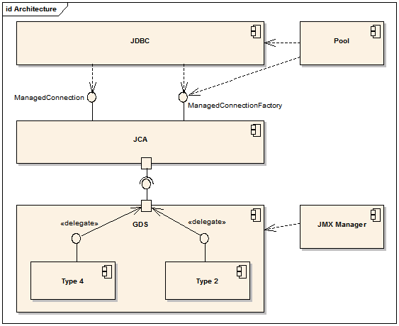

License {-}
=======

The contents of this Documentation are subject to the Public Documentation
License Version 1.0 (the "License"); you may only use this Documentation if you
comply with the terms of this License. A copy of the License is available at
<http://www.firebirdsql.org/manual/licenses-pdl-text.html>.

The Original Documentation is Jaybird 2.1 JDBC driver Java Programmer's Manual. 
The Initial Writer of the Original Documentation is Roman Rokytskyy Copyright 
(C) 2004-2008. All Rights Reserved. (Initial Writer contact(s): 
roman@rokytskyy.de).

Contributor(s): Mark Rotteveel.

Portions created by Mark Rotteveel are Copyright (C) 2014-2016. All Rights 
Reserved. (Contributor contact(s): mrotteveel@users.sourceforge.net).

Portions created by ______ are Copyright (C)_________[Insert year(s)]. All 
Rights Reserved. (Contributor contact(s):________________[Insert hyperlink/alias]).

Introduction
============

Jaybird is a JCA/JDBC driver suite to connect to Firebird database
server. When Borland released an open-source version of the InterBase
RDBMS, it included sources for a type 3 JDBC driver called InterClient.
However due to some inherent limitations of the InterBase (and later
Firebird) client library, it was decided that the type 3 driver was a
dead end, and the Firebird team developed a pure Java implementation of
the wire protocol. This implementation became the basis for Jaybird, a
pure Java driver for Firebird relational database.

This driver is based on both the new JCA standard for application server
connections to enterprise information systems and the well known JDBC
standard. The JCA standard specifies an architecture in which an
application server can cooperate with a driver so that the application
server manages transactions, security, and resource pooling, and the
driver supplies only the connection functionality.

Jaybird architecture
--------------------

The Jaybird driver consists of three layers, each of which is
responsible for its part of the functionality. The component diagram
depicting the Jaybird internal structure contains two additional
components: "pool" and "JMX manager".

-   The GDS layer represents a Java translation of the Firebird API. It
    is represented by two classes from `org.firebirdsql.gds` package:
    `GDS` interface and `GDSFactory`. GDS factory class is responsible
    for instantiating an implementation of the `GDS` interface depending
    of the type of driver used. Implementation of the `GDS` interface
    determines the type of the driver that will be used.
-   The JCA layer represents the heart of the driver. Here all
    connection and transaction management happens. Additionally this
    layer adapts the GDS API and proxies the calls to the
    GDS implementation.
    
      
    
-   The JDBC layer is an implementation of the JDBC specification.
-   The Pool component represents implementation of
    `ConnectionPoolDataSource`, `DataSource` and `XADataSource`
    interfaces from the JDBC 2.0 Optional Package. The pool
    implementation uses `ManagedConnectionFactory` to create physical
    connections to the database.
-   The Manager component represents a JMX 1.0 compatible implementation
    that uses The Services API to manage the database and the
    server itself. Currently only calls to create and drop database are
    available, but in the future a full range of services will be made
    public: database backup/restore, user management, statistics
    gathering, etc.

Supported Servers
-----------------

Jaybird 2.1 supports all current Firebird servers, however no support
for the optimized wire protocol from the Firebird 2.1 is being
implemented. Jaybird versions 2.x in current distribution won't work
with InterBase and Yaffil servers, however the compatibility might be
restored in the future.

Supported Specifications
------------------------

Jaybird supports the following specifications:

+----------------------------+-----------------------------------------------------------------+
| Specification              | Details                                                         |
+============================+=================================================================+
| JDBC 3.0                   | Driver passes the complete JDBC compatibility test suite,       |
|                            | though some features are not implemented. It is not officially  |
|                            | JDBC compliant, because of the high certification costs.        |
+----------------------------+-----------------------------------------------------------------+
| JDBC 2.0 Optional Package\ | Jaybird provides an implementation of following interfaces      |
| (formerly Standard         | from `javax.sql.*` package:                                     |
| Extension API)             |                                                                 |
|                            | - The `ConnectionPoolDataSource` implementation provides        |
|                            |   connection and prepared statement pooling.                    |
|                            | - The `DataSource` implementation provides seamless integration |
|                            |   with major web and application servers.                       |
|                            | - The XADataSource implementation provides means to use driver  |
|                            |   in distributed transactions.                                  |
+----------------------------+-----------------------------------------------------------------+
| JCA 1.0                    | Jaybird provides an implementation of                           |
|                            | `javax.resource.spi.ManagedConnectionFactory` and related       |
|                            | interfaces. CCI interfaces are not supported.                   |
+----------------------------+-----------------------------------------------------------------+
| JTA 1.0.1                  | The driver provides implementation of the                       |
|                            | `javax.transaction.xa.XAResource` interface via the JCA         |
|                            | framework and a `javax.sql.XADataSource` implementation.        |
+----------------------------+-----------------------------------------------------------------+
| JAAS 1.0                   |                                                                 |
+----------------------------+-----------------------------------------------------------------+
| JMX 1.2                    | Jaybird provides an MBean that allows creating and dropping     |
|                            | databases via JMX agent.                                        |
+----------------------------+-----------------------------------------------------------------+

Distribution package
--------------------

Jaybird driver has compile-time and run-time dependencies to JCA 1.0,
JTA 1.0.1, JAAS 1.0 and JDBC 2.0 Optional Package. Additionally, if
Log4J classes are found in the class path, it is possible to enable
extensive logging inside the driver.

Following file groups can be found in distribution package:

+------------------------+--------------------------------------------------------------------+
| File name              | Description                                                        |
+========================+====================================================================+
| jaybird-2.1.6.jar      | An archive containing the JDBC driver, the JCA connection manager, |
|                        | the Services API and event management classes.                     |
+------------------------+--------------------------------------------------------------------+
| jaybird-full-2.1.6.jar | Same as above but also the connection pooling classes.             |
+------------------------+--------------------------------------------------------------------+
| jaybird21.dll          | Precompiled version of the JNI library for Type 2 and Embedded     |
|                        | Server drivers for 32-bit Windows platform.                        |
+------------------------+--------------------------------------------------------------------+
| libjaybird21.so        | Precompiled version of the JNI library for Type 2 and Embedded     |
|                        | Server drivers for 32-bit Linux platforms.                         |
+------------------------+--------------------------------------------------------------------+

Quality Assurance
-----------------

The Jaybird team uses JUnit test cases to assure the quality of the
released driver. Also during development unit tests are extensively
used. It is not allowed to commit a code to the CVS until it passes all
existing unit tests. Also each reproducible bug usually gets its own
test case. This guarantees that a clean check out from the CVS can be
compiled and will not contain any previously discovered and fixed bug.
Currently there are more than 450 test cases covering most of the driver
code.

Additionally, before the driver is released, is is required to pass JDBC
compatibility suite (CTS), which currently contains 1216 test cases.
Unfortunately Firebird does not support all features used by the CTS, so
some test cases from the original CTS suite were excluded from run.

Useful resources
----------------

JDBC

For extensive JDBC documentation, see the "Documentation" section of
Sun's website <http://java.sun.com/products/jdbc/>.

Firebird

General information about the Firebird database is available from the
Firebird web site
(<http://www.firebirdsql.org/>).

Information about using SQL in Firebird, see the "Language Reference"
and "Developer's Guide" documents, that are available for download from
the "Main Downloads" section of the IBPhoenix web site.

Jaybird Support

A new resource JaybirdWiki has become available. It can be found at
<http://jaybirdwiki.firebirdsql.org/>. This is a place where the community 
shares information about different aspects of Jaybird usage, configuration 
examples for different applications/servers, tips and tricks, FAQ, etc.

Obtaining a connection
======================

Jaybird is regular JDBC driver and supports two primary ways to obtain
connection: via `java.sql.DriverManager` and via `javax.sql.DataSource`
interface.

Obtaining connection java.sql.DriverManager
-------------------------------------------

`java.sql.DriverManager` historically was the first connection factory
in Java. It is based on the concept of the JDBC URL, a string that
uniquely identifies JDBC driver to use and the database to which user
wants to connect. Additionally there is possibility to specify
additional connection parameters, like user name and password.

JDBC URL consists of three parts:
<!-- TODO: investigate if it is possible to reproduce presentation as in ODT -->

    jdbc:firebirdsql://localhost:3050/c:/database/example.fdb
    
- `jdbc`\
  JDBC protocol
- `firebirdsql`\
  JDBC subprotocol, identifies driver to use
- `//localhost:3050/c:/database/example.fdb`\
  RDBMS specific part, identifies the database to which the driver must connect,
  in our case that is `//<host>:<port>/<path to database>`

First part, "`jdbc:firebirdsql:`" is always fixed and specifies the so
called protocol and subprotocol for the JDBC connection. In other words,
the type of the connection that the application wants to obtain, in our
case it is a connection to a Firebird database. Example of obtaining the
connection is shown below.

~~~ {.java}
package hello;

import java.sql.*;

public class HelloServer {

  public static void main(String[] args) throws Exception {
  
    Class.forName("org.firebirdsql.jdbc.FBDriver");
    
    Connection connection = DriverManager.getConnection(
      "jdbc:firebirdsql://localhost:3050/c:/db/employee.fdb",
      "SYSDBA", "masterkey");
      
    // do something here
  }
}
~~~

The first line of this code is important – it tells JVM to load the
Jaybird 2.1 JDBC driver. According to JDBC specification, at this point
driver registers itself in `java.sql.DriverManager` and tells it for
which protocol it is responsible for.

There are two ways to register JDBC driver:

-   **Possibility 1**. The application loads the driver's class. The
    JDBC specification requires that during class initialization the
    driver performs the registration itself.

        Class.forName("org.firebirdsql.jdbc.FBDriver");

-   **Possibility 2**. The JDBC driver is listed in a `jdbc.drivers`
    system property. For example in your `\~/.hotjava/properties` file
    you can specify following line:

        jdbc.drivers=foo.Driver:org.firebirdsql.jdbc.FBDriver

Alternatively you can specify the value of this property during JVM
startup:

    java\
      -Djdbc.drivers=org.firebirdsql.jdbc.FBDriver\
      -classpath jaybird-full-2.1.6.jar;C:/myproject/classes\
      my.company.SomeJavaExample

The second statement of the example tells the `java.sql.DriverManager`
to open database connection to the Firebird server running on the host
where Java code is executed, and the path to the database is
`c:/database/employee.fdb`.

Database specification consists of the name of the server where the
database server resides, optionally you can specify a port to which the
driver will connect (by default port 3050 is used). The server name can
be specified either using its IP address (for example 192.168.0.5) or
using its DNS name (for example `fb-server.mycompany.com` or just
`fb-server`).

After the server name and port, path to the database is specified. The
format in which the path is specified depends on the platform where the
Firebird server runs. On Windows it must include the drive letter and
path, for example `"c:/database/employee.gdb"`, which points to the
employee database that can be found in a root directory of drive C:.
Java allows to use either `"/"` or `"\\"` as path separator on the
Windows platform. On Unix and Linux platform, you can use only `"/"` as
the path separator.

If you are using Firebird 1.5 or higher, you can specify a database
alias instead of the absolute database path. For more information about
using aliases see the documentation of the Firebird server.

### Specifying extended properties

What if we want to specify additional connection parameters, a client
encoding, for example? JDBC specification provides another method that
allows to specify additional connection properties:

~~~ {.java}
package hello;

import java.sql.*;
import java.util.*;

public class HelloServerWithEncoding {

  public static void main(String[] args) throws Exception {
  
    Class.forName("org.firebirdsql.jdbc.FBDriver");
    
    Properties props = new Properties();
    
    props.setProperty("user", "SYSDBA");
    props.setProperty("password", "masterkey");
    props.setProperty("encoding", "UNICODE_FSS");
    
    Connection connection = DriverManager.getConnection(
      "jdbc:firebirdsql://localhost:3050/C:/employee.gdb",
      props);
      
    // do something here
  }
}
~~~

Additional properties, for example SQL role for the connection can be
added to the `props` map. The list of all available extended properties
can be found in [Extended connection properties].

However, not in every place you can use the above described method.
Jaybird provides a possibility to specify extended properties in the
JDBC URL. The example below shows the specification for specifying extended JDBC
properties in the URL.

~~~
jdbc:firebirdsql://host[:port]/<path to db>?<properties>
<properties> ::= <property>[&<properties>]
<property>   ::= <name>[=<value>]
~~~

In this case extended properties are passed together with the URL using
the HTTP-like parameter passing scheme: first comes main part of the
URL, then `"?"`, then name-value pairs separated with `"&"`. Code below is
equivalent to the previous example.

~~~ {.java}
import java.sql.*;

...

Class.forName("org.firebirdsql.jdbc.FBDriver");

Connection connection = DriverManager.getConnection(
    "jdbc:firebirdsql://localhost:3050//C:/employee.gdb" + 
    "?encoding=UNICODE_FSS",
    "SYSDBA",
    "masterkey");
~~~

### Obtaining a connection via javax.sql.DataSource

JDBC 2.0 specification introduced a new mechanism to obtain database
connection without requiring the application to know any specifics of
the underlying JDBC driver. The application is required to know a
logical name under which application can find an instance of the
`javax.sql.DataSource` interface using Java Naming and Directory
Interface (JNDI). This is a common way to obtain connections in web and
application servers.

In order to obtain a connection via `DataSource* object`, you can use
code showed below. This code assumes that you have correctly configured
JNDI properties. For more information about configuring JNDI please
refer to the documentation provided with your web or application server.

~~~ {.java}
package hello;

import java.sql.*;
import javax.sql.*;
import javax.naming.*;

public class HelloServerJNDI {

  public static void main(String[] args) throws Exception {
  
    InitialContext ctx = new InitialContext();
    DataSource ds = (DataSource)ctx.lookup("jdbc/SomeDB");
    
    Connection connection = ds.getConnection();
    
    try {
      // do something here... 
    } finally {
      connection.close();
    }
  }
}
~~~

Usually binding between the `DataSource` object and its JNDI name
happens in the configuration of your web or application server. However
under some circumstances (e.g. you are developing your own JNDI-enabled
application server/framework) you have to do this yourself. You can use
this code snippet for this purpose:

~~~ {.java}
import javax.naming.*;
import org.firebirdsql.pool.*;
...
FBWrappingDataSource ds = new FBWrappingDataSource();

ds.setDatabase("localhost/3050:C:/database/employee.gdb");
ds.setUser("SYSDBA");
ds.setPassword("masterkey");

InitialContext ctx = new InitialContext();

ctx.bind("jdbc/SomeDB", ds);
~~~

`DataSource` implementation supports all connection properties available
to the `DriverManager` interface, but also it supports additional
properties that control connection pooling. For more information on this
topic please read the [Connection Pooling] chapter.

Driver types
------------

As it was mentioned in the section [Jaybird Architecture], Jaybird supports
multiple implementations of the GDS interface. The original Jaybird
distribution contains two main categories of the GDS implementation:
pure Java implementation of the Firebird wire protocol and a JNI proxy
that can use a dynamically linked library with a compatible API.

Below you find the list of existing types and their short configuration
description with the corresponding JDBC URLs that should be used to
obtain the connection of desired type. The type of the JDBC driver for
the `javax.sql.DataSource` is configured via corresponding property.

### PURE\_JAVA type

The PURE\_JAVA driver type uses pure Java implementation of the Firebird
wire protocol. This type is recommended for connecting to a remote
database server using TCP/IP sockets. No installation is required except
adding the JDBC driver to the class path. This type of driver provides
best performance when connecting to the remote server.

In order to obtain connection using the PURE\_JAVA driver type you have
to use JDBC URL that was shown on :

    jdbc:firebirdsql://host[:port]/<path to database>

When using `javax.sql.DataSource` implementation, you can specify either
`"PURE_JAVA"` or `"TYPE4"` driver type, however this type is used by
default.

### NATIVE and LOCAL types

The NATIVE and LOCAL driver types use a JNI proxy to access the Firebird
client library and requires installation of the Firebird client. The
NATIVE driver type is used to access the remote database server, the
LOCAL type accesses the database server running on the same host by
means of IPC. Performance of NATIVE driver is approximately 10% lower
compared to the PURE\_JAVA driver, but LOCAL type has up to 30% higher
performance compared to the PURE\_JAVA driver when connecting the server
on the same host. This is mostly due to the fact that TCP/IP stack is
not involved in this mode.

In order to instantiate a connection using the NATIVE JDBC driver to
connect to a remote server you have to use the following JDBC URL with
new subprotocol:

    jdbc:firebirdsql:native:host[/port]:<path to database>

When connecting to a local database server using the LOCAL driver, you
should use following:

    jdbc:firebirdsql:local:<absolute path to database>

Additionally to the Firebird client library installation, driver
requires a JNI proxy to be available to the JVM. The JNI proxy is a
platform-dependent dynamically linked library that translates GDS calls
into Firebird API calls.

#### Windows

On Windows, the JNI proxy is represented by a dynamically linked library
(DLL) `jaybird21.dll`. You have to make this library available through
`PATH` environment variable. Alternatively you can specify the directory
containing this DLL in `java.library.path` system property.

For example, if you put library in the current directory you have to use
the following command to start Java:

    java -Djava.library.path=. com.mycompany.MyClass

#### Linux

On Linux JNI proxy is represented by a shared library `libjaybird21.so`*.
It must be available through the `LD_PATH` environment variable.
Usually shared libraries are stored in the `/usr/lib/` directory;
however you will need root permissions to copy `libjaybird21.so` there.
Alternatively you can specify directory containing the proxy in
`java.library.path` Java system property. See Windows example above for
more details.

#### Limitations

Firebird client library is not thread-safe when connecting to a local
database server using IPC. Jaybird provides the necessary
synchronization in Java code using a static object instance. However,
this static object instance is local to the classloader that has loaded
the Jaybird classes.

In order to guarantee correct synchronization , the Jaybird driver must
be loaded by the top-most classloader. For example, when using the Type
2 JDBC driver with a web or application server, you have to add the
Jaybird classes to the main classpath (for example, to the `lib/`
directory of your web or application server), but **not** to the web or
J2EE application, e.g. the `WEB-INF/lib` directory.

### EMBEDDED type

The Embedded server JDBC driver is the Type 2 JDBC driver that rather
than using the Firebird client library, loads Firebird embedded server
library instead. This is the highest performance type of JDBC driver for
accessing local databases, as the Java code accesses the database file
directly.

In order to obtain a connection via DriverManager you have to use
following URL:

    jdbc:firebirdsql:embedded:<path to database>

    jdbc:firebirdsql:embedded:host[/port]:<path to database>

When host and, optionally, port is specified, embedded server acts as
client library (i.e. you get the same Type 2 behavior as you would get
with using "native").

Installation of the JNI proxy is same as described in the "[NATIVE and LOCAL types]" 
section.

#### Limitations

The Firebird embedded server for Linux is not thread safe. Jaybird
provides the needed synchronization in Java code, similar to the one
described for the Type 2 JDBC driver. This implies the same restrictions
on the classloader that will load the Jaybird classes.

The Firebird embedded server for Windows opens databases in exclusive
mode. This means that this particular database is accessible only to one
Java virtual machine. *There is no exclusive mode on the POSIX platform.
When the same database file is accessed by multiple JVM instances,
database will be corrupted!*

Connection Pooling
------------------

Each time a connection is opened via DriverManager, a new physical
connection to server is opened. It is closed when the connection is
closed. In order to avoid the overhead of creating connections, the
DataSource implementation can maintain a cache of open physical
connections that can be reused between user sessions.

The javax.sql.ConnectionPoolDataSource implementation
-----------------------------------------------------
<!-- Information in this section is outdated/deprecated -->

> Warning: The code presented in this section is deprecated
> and not correct/typical usage

`FBConnectionPoolDataSource` is an implementation of the
`javax.sql.ConnectionPoolDataSource` interface, which is used by an
application to obtain `PooledConnection` objects. A `PooledConnection`
instance represents a physical connection to a database and is a source
of logical connection. Closing a logical connection returns the physical
connection back into the pool. Additionally, the logical connection
provides caching of prepared statements, which improves application
performance even more than connection pooling.

Usually the connection pool is specified in web or application server
configuration. However, you can instantiate it also inside the
application.

~~~ {.java .numberLines}
package hello;

import java.sql.*;
import javax.sql.*;
import org.firebirdsql.pool.*;

public class HelloConnectionPool {

  public static void main(String[] args) throws Exception {
  
    org.firebirdsql.pool.FBConnectionPoolDataSource pool = 
      new org.firebirdsql.pool.FBConnectionPoolDataSource();
      
    pool.setMaxPoolSize(5);
    pool.setMinPoolSize(2);
    pool.setMaxStatements(10);
    pool.setMaxIdleTime(30 * 60 * 60);
    
    pool.setDatabase("localhost/3050:C:/db/employee.fdb");
    pool.setUser("SYSDBA");
    pool.setPassword("masterkey");
    
    // obtain a physical connection to the database
    PooledConnection pooledCon = pool.getPooledConnection();
    
    // obtain a wrapped connection    
    Connection connection = pooledCon.getConnection();
    try {
      // do something here...
    } finally {
      // release the connection back to pool
      connection.close();
    }
  }
}
~~~

In the code above we perform the following steps:

1. Lines 11-12: Create a connection pool object. In this example we create 
   instance implementing the `javax.sql.ConnectionPoolDataSource` interface.
2. Lines 14-17: Now we specify the pooling properties: maximum of 5 physical
   connections, with minimum of 2, and each connection will maintain a cache of
   10 prepared statements of the same type (i.e. with the same SQL). Connections
   in the pool that are idle for more than half an hour (30 \* 60 \* 60 seconds)
   are closed automatically.
3. Lines 19-21: After specifying the pooling properties we set the database
   connection properties. In our case that is only database path, user name and
   password, but also any other supported property can be set here.
4. Line 24: Having configured the data source, we obtain the physical connection
   to the database. Our data source implementation will check the internal
   connection pool and will open a new physical connection to the database if 
   the pool is empty. An instance of `javax.sql.PooledConnection` represents a 
   physical connection to the database. Calling the `PooledConnection.close()`
   method will close the physical connection to the database and will remove 
   this connection from the pool.
5. Line 27: Now we obtain regular JDBC connection to the database and perform
   the needed work.
6. Line 32: At the end of processing we close the JDBC connection, but note that
   we do not close the physical connection, but simply forget the reference to
   it.

Please pay especial attention to the steps 4, 5 and 6. They show the
typical approach of using the JDBC connections in case of connection
pooling. The step 4 is to some extent optional – if we use
`javax.sql.DataSource` connection factory, it provides already wrapped
JDBC connections doing the step 4 implicitly.

However it must be a rule for an application to use the `try/finally`
block to release the connection. In the XXX chapter we will discuss the
transaction boundaries and how they can influence that connection
handling, but for the code running in the J2EE environment the
`try/finally` guarantees that connections are never leaked in the
application code, the container will take care for the rest.

List of all pool-related properties can be found in "[Pool Properties]" and 
"[Runtime Pool Properties]".

Using FBConnectionPoolDataSource with JNDI
------------------------------------------
<!-- Information in this section is outdated/deprecated -->

> Warning: The code presented in this section is deprecated
> and not correct/typical usage

Connection pooling is tightly coupled with the Java Naming and Directory 
Interface, which provides a network-transparent hierarchical mapping of 
the symbolic references to objects. As it was showed in 
[Obtaining a connection via javax.sql.DataSource], pooled connections are 
obtained from JNDI using a symbolic reference, a JNDI name. When an application
binds an object into JNDI, typically following happens:

-   If object implements `java.io.Serializable` interface, object is
    directly bound to the specified name. If application accesses the
    JNDI from the local JVM, a reference to the object bound in JNDI
    is returned. If application accesses the JNDI from remote JVM, a
    serialized copy of an object is sent over the wire to the remote
    node, where it is deserialized and returned to the application
-   If object implements *`javax.naming.Referencable` interface, JNDI
    implementation binds the so-called reference instead of an object.
    Reference contains all necessary information to reconstruct the
    object regardless of the JVM in which this operation happens. This
    is performed with the help of so-called object factories. Object
    factory knows how to convert instance of `javax.naming.Reference`
    into an appropriate object.
-   If object implements none of the above mentioned interfaces, the
    behavior is undefined. Usually JNDI provider allows to access bind
    objects in local JVM, but when access happens in remote JVM, an
    exception is thrown.

`FBConnectionPoolDataSource` implements both `java.io.Serializable`* and
`javax.naming.Referencable` interfaces. The code below shows how to create and
bind the JNDI reference for a `FBConnectionPoolDataSource` class:

~~~ {.java .numberLines}
package hello;

import javax.naming.*;
import org.firebirdsql.pool.*;

public class HelloBindJndi {

  public static void main(String[] args) throws Exception {
  
    Reference ref = new Reference(
        "org.firebirdsql.pool.FBConnectionPoolDataSource");
        
    ref.add(new StringRefAddr("maxPoolSize", "5"));
    ref.add(new StringRefAddr("minPoolSize", "2"));
    ref.add(new StringRefAddr("maxStatements", "10"));
    ref.add(new StringRefAddr("maxIdleTime", "108000"));
    
    ref.add(new StringRefAddr("database",
        "localhost/3050:C:/db/employee.fdb));
    ref.add(new StringRefAddr("user", "SYSDBA"));
    ref.add(new StringRefAddr("password", "masterkey"));
    
    Context ctx = new InitialContext();
    ctx.bind("jdbc/test", ref);
  }
}
~~~

1.  Lines 10-11: Create reference instance for the `FBConnectionPoolDataSource`.
    According to the JNDI specification we could specify another type
    here, however the identifier specified here is used later by the
    object factory to check whether it is responsible for materializing
    the specified reference. Our object factory accepts only references
    with the ID equal to `"org.firebirdsql.pool.FBConnectionPoolDataSource"`.
2.  Lines 13-16: Fill the pooling properties as reference addresses.
3.  Lines 18-21: Fill the database connection properties. Steps 2 and 3 look 
    quite strange from the programming point of view, especially compared to
    the previous section. However, this approach is very elegant if we consider
    reading the configuration from the file. In this case we no longer have to
    use Java reflection to set needed properties – object factory does it for 
    us.
4.  Lines 23-24: Create JNDI initial context and bind the reference to the
    specified name.

The next example shows how to access the FBConnectionDataSource bound in 
previous example:

~~~ {.java .numberLines}
package hello;

import java.util.*;
import javax.naming.*;
import org.firebirdsql.pool.*;

public class HelloLookupJndiFactory {

  public static void main(String[] args) throws Exception {
  
    Hashtable props = new Hashtable();
    
    props.put(
        "java.naming.factory.initial",
        "com.sun.jndi.fscontext.RefFSContextFactory");
        
    props.put(
        "java.naming.factory.object", 
        "org.firebirdsql.pool.FBConnectionPoolDataSource");
        
    Context ctx = new InitialContext(props);
    FBConnectionPoolDataSource pool = 
      (FBConnectionPoolDataSource)ctx.lookup("jdbc/test");
  }
}
~~~

1.  Line 11: Create an environment for the JNDI initial context.
2.  Line 13-15: Specify the "java.naming.factory.initial" property. Our example
    uses Sun file system JNDI provider. In J2EE environment this
    property should match the one used by J2EE container. Additionally
    one has to specify the "java.naming.provider.url" when accessing
    remote JVM.
3.  Lines 17-19: Specify the "java.naming.factory.object" property. In our case
    it contains only one object factory – our pool class itself. In J2EE
    environment one has to configure the environment correctly.
4.  Lines 21-23: Create JNDI context and perform the JNDI lookup.

The javax.sql.DataSource implementation
---------------------------------------
<!-- Information in this section is outdated/deprecated -->

> Warning: The code presented in this section is deprecated
> and not correct/typical usage

The example before showed how to work with the Jaybird 2.1 connection
pool. However, the `javax.sql.ConnectionPoolDataSource` is usually not
accessible to the application code, as it provides the ability to
manipulate physical connections. In a J2EE environment application
accesses the instance of `javax.sql.DataSource` interfaces instead. This
is usually done by wrapping the connection pool by a simple
implementation of the latter interface. Jaybird 2.1 provides such
implementation in `org.firebirdsql.pool.SimpleDataSource` class that
takes `javax.sql.ConnectionPoolDataSource` as parameter in constructor.

Additionally Jaybird 2.1 provides a class that can be used in the same
was as the `FBConnectionPoolDataSource`. The next example shows how to 
instantiate `FBWrappingDataSource` implementation in a client application.

~~~ {.java .numberLines}
package hello;

import java.sql.*;
import javax.sql.*;
import org.firebirdsql.pool.*;

public class HelloConnectionPool {

  public static void main(String[] args) throws Exception {
  
    org.firebirdsql.pool.FBWrappingDataSource pool = 
      new org.firebirdsql.pool.FBWrappingDataSource();
      
    pool.setMaxPoolSize(5);
    pool.setMinPoolSize(2);
    pool.setMaxStatements(10);
    pool.setMaxIdleTime(30 * 60 * 60);
    
    pool.setDatabase("localhost/3050:C:/db/employee.gdb");
    pool.setUser("SYSDBA");
    pool.setPassword("masterkey");
    
    // no step 4 as in previous example
    
    // obtain a wrapped connection    
    Connection connection = pool.getConnection();
    try {
      // do something here...
    } finally {
      // release the connection back to pool
      connection.close();
    }
  }
}
~~~

This class is called "wrapping" because it wraps the connection pool and
delegates all calls to the underlying implementation. As you can see,
the code is very similar to the example in 
[The javax.sql.ConnectionPoolDataSource implementation], only few places are
different. Please note, that there is no longer Step 4, the wrapper does this
automatically in `getConnection()` method used in Step 5 (line 26).

The javax.sql.XADataSource implementation
-----------------------------------------
<!-- Information in this section is outdated/deprecated -->

> Warning: The code presented in this section is deprecated
> and not correct/typical usage

JDBC 2.0 specification introduced the javax.sql.XADataSource interface
that should be used to access connections that can participate in
distributed transactions with JTA-compatible transaction coordinator.
This gives applications possibility to use two-phase commit to
synchronize multiple resource managers.

Jaybird 2.1 does not have separate class, but FBConnectionPoolDataSource
also implements the javax.sql.XADataSource interface. For information
how to instantiate this class please see 
[The javax.sql.ConnectionPoolDataSource implementation].

Applications usually do not need to access the javax.sql.XADataSource
directly, this is task for a J2EE container. Chapter XXX contains more
detailed description of distributed transactions and contains code to
access and manipulate connections that participate in distributed
transactions.

Handling exceptions
===================

An exception handling is probably the most important aspect that
directly affects the stability of the application. Correct handling of
the error cases guarantees correct functioning of the client code as
well as the database server. Additionally, all methods of the interfaces
defined in the JDBC specification throw instances of
`java.sql.SQLException` to notify about all error conditions that happen
during request processing. The `SQLException` is checked exception,
which forces Java programmer to either handle it with the try/catch
clause or redeclare it in the method signature.

Working with exceptions
-----------------------

The exception handling becomes even more important if we consider that
this topic is either ignored or presented in incorrect form in the most
JDBC tutorials. The official JDBC tutorial from Sun Microsystems briefly
mentions that exceptions should be handled by using try/catch blocks
only at the end of the course, but neither reasons of doing this nor the
best practices are presented.

There are few reasons to think about exception handling in your
applications before you start coding. First of all, it is very hard to
change the exception handling pattern in the existing code. The changes
will affect all layers above the place where the changes in exception
handling are made and the new application must be thoroughly tested
after the change.

Another reason was already mentioned on the beginning of this chapter –
instances of `java.sql.SQLException` is the only way for the RDBMS
server to notify about the error condition that happened during request
processing. By checking the error code which is sent with the exception
application can try to recover from the error.

And the last but not the least issue is the resource management. When
exception happens in the method, the execution flow of Java code differs
from the normal one and only correctly coded application will ensure
that all allocated resources will be released. The resources in our case
are JDBC connections, statement, prepared statement and callable
statement objects, result sets, etc. All these objects not only take
memory in the Java Virtual Machine in which application runs, but also
consume memory on the server, which in worst cases can lead to
Denial-of-Service attack.

A good exception handling strategy requires you do distinguish three
kinds of error conditions:

-   errors that database access layer can detect and correctly handle;
    for example, the application might decide to re-execute the business
    transaction if database server returned a deadlock error;
-   errors that database access layer can detect, but is unable to
    handle; usually those are all database errors that do not have
    special handling routines;
-   errors that database access layer cannot detect without additional
    code unrelated to the functionality of this layer; basically, all
    runtime exceptions fall into this category.

The handling strategy then consists of

-   processing the selected error codes for cases described above;
-   converting the generic SQLException into generic business error in
    the application (this can be throwing some generic exception defined
    in the application, but can also be an entry in the application
    event log and short message that asks to retry the operation later);
-   some emergency tactics, since the error that happened (e.g.
    NullPointerException or OutOfMemoryError) was not considered while
    the application was created, thus possibly leaving it in an unknown
    state; further operating should be considered dangerous and the
    corresponding execution branch has to be halted.

The problem can be solved if resource allocation and deallocation
happens in the same code block and is protected with try/finally block
and the code to recover from error conditions should use try/catch
blocks. Example of such error and resource handling code is presented below.

~~~ {.java}
PreparedStatement updateSales = null;

String updateString = "update COFFEES " +
    "set SALES = ? where COF_NAME like ?";
    
updateSales = con.prepareStatement(updateString);

try {
    int [] salesForWeek = {175, 150, 60, 155, 90};
    String [] coffees = {"Colombian", "French_Roast",
        "Espresso", "Colombian_Decaf",
        "French_Roast_Decaf"};
        
    int len = coffees.length;
    
    for(int i = 0; i < len; i++) {
    
        updateSales.setInt(1, salesForWeek[i]);
        updateSales.setString(2, coffees[i]);
        
        try {
            updateSales.executeUpdate();
        } catch(SQLException ex) {
            if (ex.getErrorCode() == ...)
                // do something
            else
                throw new BusinessDBException(ex);
        }
    }
} finally {
    updateSales.close();
}
~~~

The nested try/catch block shows you an example of handling a deadlock
error if it happens (first scenario according to our classification),
otherwise the exception is converted and passed to the upper layers
(second scenario). As you see, there is no special treatment to the
third scenario.

A possible bug in the JDBC driver could have generated runtime exception
in the `PreparedStatement.executeUpdate()` method, which would lead to
the statement handle leakage if no try/finally block is used to do the
resource cleanup. As a rule of thumb, the "try" keyword should go right
after the resource was allocated and the "finally" keyword should be
placed right before the resource is freed.

Such coding practice might look weird, because on the first sight the
whole purpose of using the `PreparedStatement` is neglected – statement
is prepared, used only once and then deallocated. However, when this
practice is combined with the connection and statement pooling, it
brings enormous advantage to the application code. The code becomes much
more manageable – resource allocations and deallocations happen in the
same method and software developer must not remember the places where
the same prepared statement might be used – statement pool will either
reuse the statement or it will prepare a new one, if it detects that all
pooled prepared statements are currently in use. As a side effect,
application will always use the minimum number of statements handles,
which in turn reduces the used resources on the server side.

Warnings
--------

Some errors returned by the Firebird server are treated as warnings.
They are converted into instances of `java.sql.SQLWarning` class in the
JDBC layer. These exceptions are not thrown from the driver methods, but
added to a connection instance. Currently no warning is added to
`Statement` or `ResultSet` objects.

Each next warning is appended to the tail of the warning chain. In order
to read the warning chain, use the code presented below.

~~~ {.java}
import java.sql.*;
....
SQLWarning warning = connection.getWarnings();
while (warning != null) {
    .... // do something with the warning
    warning = warning.getNextWarning();
}
~~~

In order to clear existing warning, call `Connection.clearWarnings()`
method.

java.sql.SQLException in Jaybird
--------------------------------

An SQLException is a special exception that is thrown by the JDBC
connectivity component in case of an error. Each instance of this
exception is required to carry the vendor error code (if applicable) and
a SQL state according to the X/Open SQLstate or SQL 2003 specifications.

When multiple SQL errors happened, they are joined into a chain. Usually
the most recent exception is thrown to the application, the exceptions
that happened before can be obtained via `SQLException.getNextException()`
method.

Unfortunately the JDBC specification does not provide a usable exception
hierarchy that would allow application to react on the error situations
using regular exception handling rather than checking the error code.
Only two subclasses are defined in JDBC 3.0 specification:

-   `java.sql.DataTruncation` exception is thrown when data truncation
    error happens.
-   `java.sql.BatchUpdateException` exception is thrown when batch of
    the statement did not execute successfully and contains the result
    of batch execution.

Upcoming JDBC 4.0 will address this issue by introducing better
hierarchy of the exceptions and it will be supported by the next
versions of Jaybird.

Each of three layers in Jaybird use exceptions most appropriate to the
specific layer.

-   `org.firebirdsql.gds.GDSException` is an exception that directly
    corresponding to the error returned by the database engine.
    Instances of this class are thrown by the GDS implementations. Upper
    layers either convert these exceptions into the ones appropriate to
    that layer or catch them if driver can handle the error condition.
-   Subclasses of `javax.resource.ResourceException` are thrown by the
    JCA layer when an error happens in the JCA-related code. Upper layer
    converts this exception into a subclass of `java.sql.SQLException`.
    If the `ResourceException` was caused by the `GDSException`, latter
    is extracted during conversion preserving the error code. If
    `ResourceException` was caused by an error condition not related to
    an error returned by the database engine, error code of the
    `SQLException` remains 0.
-   Subclasses of `javax.transaction.XAException` are thrown when an XA
    protocol error happens in JCA layer. Similar to the previous case,
    `XAException` can wrap the `GDSException`, which are extracted
    during exception conversion to preserve the error code.
-   Subclasses of `java.sql.SQLException` are thrown by the JDBC layer.
    Driver has also few subclasses that might be interesting to the
    application:

    -   `org.firebirdsql.jdbc.FBDriverConsistencyCheckException` – this
        exception is thrown when driver detects an internal
        inconsistent state. SQL state is SQL\_STATE\_GENERAL\_ERROR.
    -   `org.firebirdsql.jdbc.FBDriverNotCapableException` – this
        exception is thrown when an unsupported method is called. SQL
        state is SQL\_STATE\_DRIVER\_NOT\_CAPABLE.
    -   `org.firebirdsql.jdbc.FBSQLParseException` – this exception is
        thrown when incorrect escaped syntax is detected. SQL state
        is SQL\_STATE\_INVALID\_ESCAPE\_SEQ.
    -   `org.firebirdsql.jdbc.field.TypeConversionException` – this
        exception is thrown when the driver is asked to perform a type
        conversion that is not defined in the JDBC specification. For a
        table of allowed type conversions see [Data Type Conversion
        Table].

SQL states
----------

Jaybird supports the SQL states from the X/Open standard, however only
few states nicely map into the Firebird error codes. Below is the table
containing the reported SQL states.

Constant name                               Constant value
------------------------------------------  --------------
SQL_STATE_INVALID_CON_ATTR                  "01S00"
SQL_STATE_NO_ROW_AVAIL                      "01S06"
SQL_STATE_GENERAL_ERROR                     "HY00"
SQL_STATE_DRIVER_NOT_CAPABLE                "HYC00"
SQL_STATE_INVALID_COLUMN                    "HY02"
SQL_STATE_INVALID_PARAM_TYPE                "HY105"
SQL_STATE_INVALID_ARG_VALUE                 "HY009"
SQL_STATE_WRONG_PARAM_NUM                   "07001"
SQL_STATE_NO_RESULT_SET                     "07005"
SQL_STATE_INVALID_CONVERSION                "07006"
SQL_STATE_CONNECTION_CLOSED                 "08003"
SQL_STATE_CONNECTION_FAILURE_IN_TX          "08007"
SQL_STATE_COMM_LINK_FAILURE                 "08S01"
SQL_STATE_INVALID_ESCAPE_SEQ                "22025"

Application can use the SQL state codes in the error handling routines
which should handle errors that are returned from different databases.
But since there is little agreement between RDBMS vendors, this method
can be used only for very coarse error distinction.

Useful Firebird error codes
---------------------------

Contrary to the SQL states, the Firebird native error codes are
extremely useful to determine the type of an error that happened.

Here you can find a short list of error codes, symbolic names of a
corresponding constant in a `org.firebirdsql.gds.ISCConstants` class,
the error message and short explanation of an error.

DDL Errors

Happen during execution of the DDL requests and two primary error codes
are used in Firebird while executing the DDL operations. There are few
other rare cases not mentioned here, but the corresponding error
messages contain enough information to understand the reason of an
error.

  -------------- ------------------------- ------------------------------------------------------------------------------------------------------------------------------------------------------------------------------------------------------------------------------------------------------
  -------------- ------------------------- ------------------------------------------------------------------------------------------------------------------------------------------------------------------------------------------------------------------------------------------------------

Lock Errors

Lock errors are reported by Firebird primarily when application tries to
modify a record which is already modified by a concurrent transaction.
Depending on the transaction parameters such error can be reported
either right after detecting it or after waiting some defined timeout
hoping that concurrent transaction will either commit or rollback and
eventually release the resource. More information on transaction locking
modes can be found in Chapter [6](#anchor-23), [Using
transactions](#anchor-23).

  -------------- ----------------------- ---------------------------------------------------------------------------------------------------------------------------------------------------------------------------------
  -------------- ----------------------- ---------------------------------------------------------------------------------------------------------------------------------------------------------------------------------

Referential Integrity Errors

Referential integrity constrains ensure that database remains in a
consistent state after the DML operation and/or whole transaction is
completed. Three primary error codes are returned when the defined
constraints are violated. The error messages are self-explanatory.

  -------------- ------------------------------- ----------------------------------------------------------------------
  -------------- ------------------------------- ----------------------------------------------------------------------

DSQL Errors

This group contains secondary codes for the primary error code
*isc\_dsql\_error* (*335544569L*), that has a message *"Dynamic SQL
Error"*.

  -------------- ---------------------------- --------------------------------------------------------------------------------------------------------------------------------------------------------------------------------------------------------------------------------------------------------
  -------------- ---------------------------- --------------------------------------------------------------------------------------------------------------------------------------------------------------------------------------------------------------------------------------------------------

Other Errors

This table contains other errors that might be interesting to the
application developer, however they do not fall into any of the previous
categories.

  -------------- ----------------------- -------------------------------------------------------------------------------------------------------------------------------------------------------------------------------------------------------------------------------------------------------------------------------------------------
  -------------- ----------------------- -------------------------------------------------------------------------------------------------------------------------------------------------------------------------------------------------------------------------------------------------------------------------------------------------

Executing statements
---------------------------------------------------------------------------------------------------------

After obtaining a connection, the next thing to do is to execute the SQL
statement. JDBC specification distinguishes three kinds of statements –
regular statements that are execute fixed SQL requests, prepared
statements used to executed SQL code with parameters in it and callable
statements that are used to execute stored procedures.

### The java.sql.Statement interface

The *java.sql.Statement* interface is the simplest interface to execute
SQL statements. It distinguishes only three types of them:

-   statements that return results, or, in other words, queries;
-   statements that change the state of the database but return no
    results;
-   INSERT statements that return the values of the columns which were
    generated by the database engine while inserting the record.

Let's check one of the typical usages showed on . In general the usage
pattern of the statement consists of three steps

:

1.  Create a *Statement* object by calling the *createStatement()*
    method of the *Connection* object.
2.  Use the Statement object by calling its methods, in our case we
    execute simple query *SELECT firstName, lastName FROM users WHERE
    userId = 5*. Processing of the query result will be discussed in
    details in the next chapter.
3.  Close the statement to release all allocated resources. In our
    example this is done in the *finally* section of the
    *try/finally* block.

The fact that connection object is a factory for the statement objects
puts a constraint on the object lifetime – statements are bound to the
connection; when the connection is closed, all statements that were
created by that connection become invalid and the resources allocated by
them are released. However, despite that fact that the resources are
finally released, it is strongly recommended to use the *try/finally*
block, to guarantee that resources are released as soon as possible
because of the reasons that will be discussed later.

Statement can be executed using the following methods:

-   *Statement.executeQuery(String)* – executes a SELECT statement and
    returns a result set. If the specified statement is not a SELECT
    statement, an *SQLException* is thrown after the
    statement execution.
-   *Statement.executeUpdate(String)* – executes INSERT, UPDATE, DELETE
    or DDL[^1] statements and returns the number of updated rows. If the
    specified statement is a query, an *SQLException* is thrown.
-   *Statement.execute(String)* – executes a statement and returns
    *true* when the statement returned a result set, otherwise an update
    was executed and *false* is returned. You can use
    *Statement.getResultSet()* method to get the result of the executed
    query or you can use *Statement.getUpdateCount()* when you have
    executed update statement.

Statement is closed by calling the *Statement.close()* method. After
this the statement object is invalid and cannot be used anymore.

It is also allowed to use the same object to execute different types of
queries one after other. The contains a short example in which
application first performs a select to find the ID of the user 'Joe
Doe', and if the record is found, it enables his account.

The way the code is constructed is quite dangerous because of the result
set lifetime constraints that are put by the JDBC specification, please
read the chapter where result sets are discussed for more details.
However, here it is done intentionally to emphasize that the single
object is used to execute SELECT and UPDATE/INSERT statements. It also
shows how to check whether the executed statement modified expected
number of rows – application first tries to update the account and only
if no rows were updated, it inserts new record into the *accounts*
table.

When application needs to execute DDL statements, it is recommended to
use the *Statement.execute(String)* method, as in this case amount of
modified records makes little sense. shows an example of creating
database tables using the above mentioned method.

First, application checks the existence of the table in the database by
calling the *DatabaseMetaData.getTables(String, String, String,
String\[\])* method that returns a result set describing the database
tables matching the specified search pattern. First two parameters of
this method, the database catalog and schema names, are set to *null* as
Firebird supports neither catalogs nor schemas. Third parameter is the
table name search pattern, in our case we search for the table
*"customer"*. Last parameter is the list of table types to check, in our
case we check for the *"TABLE"* type. Other tables types are *"SYSTEM
TABLE"* and *"VIEW"*.

After that application checks if the result set is empty by calling the
*ResultSet.next()* method. If no *"customer"* table was found,
application creates new table with three columns.

As it was already mentioned, the *Statement.execute(String)* method can
also be used to execute statements of the unknown type.

It is worth mentioning, that according to the JDBC specification
*getResultSet()* and *getUpdateCount()* methods can be only called once
per result, and in case of using Firebird, that means once per executed
statement, since Firebird does not support multiple results from a
single statement. Calling the methods the second time will cause an
exception.

### Statement behind the scenes

The example on requires us to discuss the statement object dynamics, its
life cycle and how it affects other subsystems in details.

Statement dynamics

When the Java application executes statement, a lot more operations
happen behind the scenes:

1.  A new statement object is allocated on the server. Firebird returns
    to the client a 32-bit identifier of the allocated object, a
    statement handle, that must be used in next operations.
2.  An SQL statement is compiled into an executable form and is
    associated with the specified statement handle.
3.  Jaybird asks server to describe the statement and Firebird returns
    the information about the statement type and possible statement
    input parameters (we will discuss this with prepared statements) and
    output parameters, namely a result set columns.
4.  If no parameters are required for the statement, Jaybird tells
    Firebird to execute statement passing the statement handle into
    corresponding method.

After this Jaybird has to make a decision depending on the operation
that was called.

-   If *Statement.execute()* method was used, Jaybird only checks the
    statement type to decide whether it should return true, telling the
    application that there is a result set for this operation, or false,
    if statement did not return any result set.
-   If *Statement.executeUpdate()* method was called Jaybird asks
    Firebird to give the information about the number of affected rows.
    This method can be called only if the statement type tells that no
    query can be returned by the statement. When it is called for
    queries, an exception is thrown despite the fact that the statement
    was successfully executed on the server.
-   If *Statement.executeQuery()* method was called and statement type
    tells that result set can be returned, Jaybird constructs a
    *ResultSet* object and returns it to the application. No additional
    checks, like whether result set contains rows, are performed, as it
    is the responsibility of the *ResultSet* object. If this method is
    used for the statements that do not return result set, an exception
    is thrown despite the fact that the statement was successfully
    executed on the server.

When the application does not need to know how many rows were modified,
it should use the *execute()* method instead of *executeUpdate()* one.
This saves additional call to the server to get the number of modified
rows and significantly increases the performance in the situations where
network latency is comparable with the statement execution times.

The *execute()* method is also the only method that can be used when the
application does not know what kind of statement is being executed (for
example, an application that allows the user to enter SQL statements to
execute).

After using the statement object application should close it. Two
different possibilities exist – to close the result set object
associated with the statement handle and to close the object completely.

If, for example, we want to reuse the statement object for another
query, it is not necessary to completely release the allocated
structures. Jaybird is required only to compile a new statement before
using it, in other words we can skip the step 1. This saves us one
round-trip to the server over the network, which might improve the
application performance.

If we close the statement completely, the allocated statement handle is
no longer usable. Jaybird could allocate a new statement handle, however
the implementation does not allow to use the *Statement* object after
*close()* method has been called to comply with the JDBC specification.

Statement lifetime and DDL

The step 2 in the previous chapter is probably the most important, and
usually, most expensive part of the statement execution life cycle.

As it was already told, when Firebird server receives the "prepare
statement" call, it parses the SQL statement and converts it into the
executable form – BLR representation. BLR, a Binary Language
Representation, contains low-level commands to traverse the database
tables, conditions that are used to filter records, defines the order in
which records are accessed, indices that are used to improve the
performance, etc.

When a BLR is prepared, it holds the references to all database object
definitions that are used during that statement execution. This
mechanism preserves the database schema consistency, it saves the
statement objects from the "surprises" like accessing the database table
that is been accessed by some application.

However, holding a reference on the database objects has one very
unpleasant effect – it is not possible to upgrade the database schema,
if there are active connections to the database with open statements
referencing the objects being upgraded. In other words, if two
application are running and one is trying to modify the table, view,
procedure or trigger definition while another one is accessing those
objects, the first application will receive an error 335544453 "object
is in use".

Therefore it is strongly recommended to close the statement as soon as
it is no longer needed. This invalidates the BLR and release all
references to the database objects, making them available for the
modification.

Special care should be taken when the statement pooling is used (check
the details on page [42](#anchor-27)). In this case statements are not
released even if the *close()* method is called. The only possibility to
close the pooled statements is to close the pooled connections. Please
check the corresponding chapter for more information.

### The java.sql.PreparedStatement interface

As we have seen, Jaybird already performs internal optimization when it
comes to multiple statement execution – it can reuse the allocated
statement handle in subsequent calls. However this improvement is very
small and sometimes can even be neglected when compared to the time
needed to compile the SQL statement into the BLR form.

The *PreparedStatement* interface addresses such inefficiency. An object
that implements this interface represents a precompiled statement that
can be executed multiple times. If we use the execution flow described
in the "[Statement dynamics](#Statement dynamics)" chapter, it allows to
go directly to the step 4 for the subsequent executions.

However, executing the same statement with the same values makes little
sense, unless we want to fill the table with the same data, which
usually is not the case. Therefore, JDBC provides support for the
parametrized statements – SQL statements where literals are replaced
with the question marks. Application is required to fill the parameters
before executing the statement.

Our first example in this chapter can be rewritten the way it is showed
on . At the first glance the code became more complicated without any
visible advantage.

-   First, instead of using the one statement object we have to use
    three – one per statement.
-   Second, before executing the statement we have to set
    parameters first. As it is showed on the example, parameters are
    referenced by their position. The *PreparedStatement* interface
    provides setter methods for all primitive types in Java as well as
    for some widely used SQL data types (BLOBs, CLOBs, etc.). The NULL
    value is set by calling the *PreparedStatement.setNull(int)* method.
-   Third, we are forced now to use three nested *try/finally* blocks,
    which makes code less readable.

So, where's the advantage? First of all, we can redesign our application
to prepare those statements before calling that code (for example in a
constructor) and close them when application is shut down. In this case
the code is even more compact (see ). Unfortunately the application is
now responsible for prepared statement management. When connection is
closed, the prepared statement object will be invalidated, but the
application will not be notified about this fact. Also, if the
application uses similar statements in different parts of the
application, the refactoring might affect many classes, possibly
destabilizing the code. So, the refactoring on the is not something we
want to do.

The answer to the advantage question is hidden in the
*prepareStatement(String)* call. Since the same statement can be used
for different parameter values, connection object has a possibility to
perform prepared statement caching. JDBC driver can ignore the request
to close the prepared statement, save it internally and reuse it each
time application asks to prepare an SQL statement that is known to the
connection.

### Prepared statement pooling

As it was mentioned before, connection pooling was introduced to reduce
the time needed to obtain a connection. Despite its rich features, the
operation of obtaining new connection in Firebird is cheap – usually
connection pooling in an application that heavily opens and closes
connection brings \~5% of performance.

However there is one more way to speed the application. Execution of
statements in Firebird always happens in three steps:

-   Compile the SQL statement into an internal BLR representation, save
    it in an internal structure and assign a statement handle to a
    compiled statement.
-   Execute the statement. First application checks whether the compiled
    statement has any parameters and sets them if needed. After that
    statement is executed using special call.
-   Obtain results of the statement execution, for example number of
    updated rows or a result set.

The obvious approach is to save the compiled statement and use it later.
JDBC specification already contains a *java.sql.PreparedStatement*
interface exactly for such purposes. Application prepares statement and
uses it multiple times. This approach works fine within the context of
the same connection.

However, when connection pooling is used, application can no longer
cache prepared statements, since they are bound to the connection it
obtained from the pool. Application must close all prepared statements
before giving connection back to pool, but even if it does not do this,
connection pool will perform this automatically according to the JDBC
specification. All advantages of the prepared statements are undone –
when application obtains next connection from the pool, it must
re-prepare statements.

Solution to the problem is to allow connection pool do statement pooling
internally. In this case all code remains compliant with the JDBC
specification saving all advantages of prepared statements.

Jaybird 2.1 connection pool has *maxStatements* property that controls
the behavior of the prepared statement pooling:

-   If property is set to 0, no statement pooling is performed.
-   If property is set to value *n&gt;0*, connection pool will save
    maximum *n* *java.sql.PreparedStatement* objects for the same SQL
    statement per connection. Number of pooled *PreparedStatement*
    objects corresponding to different SQL statements is not limited.

If application needs more prepared statements simultaneously (i.e. it
prepares new statement before releasing the one being currently in use),
connection pool transparently passes call to the connection object
without pooling those statements. In other words, the request to prepare
statement is always satisfied immediately, but only *n* prepared
statements will remain pooled, rest will be deallocated when
*PreparedStatement.close()* method is called.

Following limitations apply:

-   Firebird can have approx. 20.000 active statement handles
    per connection. Additional care should be used when specifying the
    value of *maxStatements* property.
-   Neither *java.sql.Statement* nor *java.sql.CallableStatement*
    objects are pooled.
-   A compiled statement in Firebird contains references on database
    objects (tables, views, procedures, etc.) needed to execute that
    SQL command. When connection pool is used, those references are not
    released preventing any structure modification of the database
    objects used in the SQL statement. Therefore, if structure
    modification is needed, connection pool with enabled statement
    pooling must be shut down.

Prepared statement pooling – advantages and drawbacks

Originally statement pooling was introduced to preserve the
*PreparedStatement* advantages when connection pooling is used. Since
the lifetime of the statement object is bound to the connection object,
prepared statement must be closed before the connection is released to
the connection pool.

When *FBConnectionPoolDataSource* or *FBWrappingDataSource* classes are
used to obtain database connections, prepared statement pooling is there
for granted. No application modification is needed to enable it, but the
performance improvement, depending on the application, might reach up to
50%.

Connections that were obtained via *DriverManager* do not provide
statement pooling and application must handle prepared statements
itself.

The biggest drawback of the statement pooling is the fact that statement
handle is not released even when application does not need the
statement, which in turn prevents database administrator to upgrade the
database schema. To overcome this issue two additional methods were
added to the connection pooling classes as well as the possibility to
switch the statement pooling off.

The *restart()* method defined in the *FBConnectionPoolDataSource* and
in the *FBWrappingDataSource* classes. This method closes all open
connection residing in the pool. Connections that are currently used in
the application are marked as "pending for close" and are deallocated as
soon as application returns them to the pool. This algorithm guarantees
that eventually all connections will be closed and statements will be
deallocated without closing the working applications. The only
requirement for successful database schema upgrade is that the
application does not "lock" the database objects before the upgrade
happens. Unfortunately there is no easy application design guidelines
that would guarantee the hot schema upgrade.

The *restart()* method can also be used during database schema upgrade
when the Firebird ClassicServer is used. There is an old issue related
to the architecture of the ClassicServer – each instance of the database
engine that is serving the application connection caches the metadata
information. So, even if the application did not have any open statement
and the database schema upgrade was successful, open connections will
not notice the change. The *restart()* method softly closes all open
connections that are not in use and ensures that new connections
obtained from the pool will use new ClassicServer instances with fresh
metadata information.

The *shutdown()* method defined in the pool classes that marks the pool
as invalid and closes all open connection regardless whether they are
currently in use or not. This method can be used if a short-time
application down time is acceptable. To continue functioning application
must construct a new pool and replace the old one since *shutdown()*
method invalidates the pool object.

### The java.sql.CallableStatement interface

The *CallableStatement* interface extends *PrepatedStatement* with
methods for executing an retrieving results from stored procedures. It
was introduced in JDBC specification in order to unify access to the
stored procedures across the database system. The main difference to
*PreparedStatement* is that the procedure call is specified using the
portable escaped syntax

Each stored procedure is allowed to take zero or more input parameters,
similar to the *PreparedStatement* interface. After being executed,
procedure can either return data in the output parameters or it can
return a result set that can be traversed. Though the interface is
generic enough to support also database engines that can return both and
have multiple result sets. These features are of no interest to Jaybird
users, since Firebird does not support them.

The IN and OUT parameters are specified in one statement. The syntax
above does not allow to specify the type of the parameter, therefore
additional facilities are needed to tell the driver which parameter is
will contain output values, the rest are considered to be IN parameters.

Firebird stored procedures

Firebird stored procedures represent a piece of code written in the PSQL
language that allows SQL statement execution at the native speed of the
engine and provides capabilities for a limited execution flow control.
The PSQL language is not general purpose language therefore its
capabilities are limited when it comes to interaction with other
systems.

Firebird stored procedures can be classified as follow:

-   Procedures that do not return any results. These are stored
    procedures that do not contain the RETURNS keyword in their header.
-   Procedures that return only a single row of results. These are
    stored procedures that contain the RETURNS keyword in their header,
    but do not contain the SUSPEND keyword in their procedure body.
    These procedures can be viewed as a functions that return
    multiple values. These procedures are executed by using the EXECUTE
    PROCEDURE statement.
-   Procedures that return result sets, also called "selectable
    stored procedures". These are stored procedures that contain the
    RETURNS keyword in their header and the SUSPEND keyword in their
    procedure body, usually within a loop. Selectable procedures are
    executed using the *"SELECT \* FROM myProcedure(...)"*
    SQL statement. It is also allowed to use EXECUTE PROCEDURE
    statement, however this call might produce strange results, since
    for selectable procedures is is equivalent to executing a SELECT
    statement, but doing only one fetch after the select. If procedure
    implementation relies on the fact that all rows that it returns must
    be fetched, the logic will be broken.

Consider the following stored procedure that returns factorial of the
specified number.

This procedure can be executed using the EXECUTE PROCEDURE call. When it
is done in isql, the output looks as follow

Now let's modify this procedure to return each intermediate result to
the client.

If you create this procedure using the isql command line tool and then
issue the *"SELECT \* FROM test\_selectable(5)"* statement, the output
will be like this:

Using the CallableStatement

Let's see how the procedures defined above can be accessed from Java.

First, we can execute this procedure showed on using the EXECUTE
PROCEDURE statement and *PreparedStatement*, however this approach
requires some more code for result set handling.

However, standard was of calling stored procedures in JDBC is to use the
*CallableStatement*. Note that the call should be specified using the
escaped syntax, but native Firebird EXECUTE PROCEDURE syntax is also
supported.

Please note the difference in the number of parameters used in the
examples. The first example contained only IN parameter on position 1
and the OUT parameter was returned in the *ResultSet* on the first
position, so it was accessed via index 1.

The latter example additionally contains the OUT parameter in the call.
We have used the *CallableStatement.registerOutParameter* method to tell
the driver that the second parameter in our call is an OUT parameter of
type INTEGER. Parameters that were not marked as OUT are considered by
Jaybird as IN parameters. Finally the *"EXECUTE PROCEDURE factorial(?)"*
SQL statement is prepared and executed. After executing the procedure
call we get the result from the appropriate getter method.

It is worth mentioning that the stored procedure call preparation
happens in the *CallableStatement.execute* method, and not in the
*prepareCall* method of the *Connection* object. Reason for this
potential deviation from the specification is that Firebird does not
allow to prepare a procedure without specifying parameters and set them
only after the statement is prepared. It seems that this part of the
JDBC specification is modeled after the Oracle RDBMS and a workaround
for this issue had to be delivered. Another side effect of this issue
is, that it is allowed to intermix input and output parameters, for
example in the "IN, OUT, IN, OUT, OUT, IN" order. Not that it makes much
sense to do this, but it might help in some cases when porting
applications from another database server.

It is also allowed to use a procedure call parameter both as an input
and output parameter. It is recommended to use this only when porting
applications from the database servers that allow INOUT parameter types,
such as Oracle.

The actual stored procedure call using the *CallableStatement* is
equivalent to the call using the prepared statement as it was showed in
the first example. There is no measurable performance differences when
using the callable statement interface.

Also the JDBC specification allows another syntax for the stored
procedure calls:

Note, that input parameters have now indices 2 and 3, and not 1 and 2 as
in the previous example. This syntax seems to be more intuitive, as it
looks like a function call. It is also possible to use this syntax for
stored procedures that return more than one parameter by combining code
from the second and the last examples.

Firebird stored procedures can also return result sets. This is achieved
by using the SUSPEND keyword inside the procedure body. This keyword
returns the current values of the output parameters as a single row to
the client.

The following example is more complex and shows a stored procedure that
computes a set of factorial of the numbers up to the specified number of
rows.

The SELECT SQL statement is the natural way of accessing the selectable
procedures in Firebird. You "select" from such procedures using the
*Statement* or *PreparedStatement* objects.

With minor issues it is also possible to access selectable stored
procedures through the *CallableStatement* interface. The escaped call
must include all IN and OUT parameters. After the call is prepared,
parameters are set the same way. However application must explicitly
tell the driver that selectable procedure is used and access to the
result set is desired. This is done by calling a Jaybird-specific method
as showed in the example below. When this is not done, application has
access only to the first row of the result set.

The getter methods from the *CallableStatement* interface will provide
you access only to the first row of the result set. In order to get
access to the complete result set you have to either call the
*executeQuery* method or the *execute* method followed by *getResultSet*
method.

Note that OUT parameter positions differ when they are accessed through
the *ResultSet* interface (the *firstCol* and *secondCol* variables in
our example). They are numbered in the order of their appearance in the
procedure call starting with 1.

When OUT parameter is accessed through the *CallableStatement* interface
(the *anotherSecondCol* parameter in our example), the registered
position should be used. In this case the result set can be used for
navigation only.

Describing Output and Input Parameters

The *PreparedStatement.getMetaData* method is used to obtain description
of the columns that will be returned by the prepared SELECT statement.
The method returns an instance of *java.sql.ResultSetMetaData* interface
that among other descriptions provides the following:

-   column type, name of the type, its scale and precision if relevant;
-   column name, its label and the display size;
-   name of the table, to which this column belongs;
-   information whether the column is read-only or writable, whether it
    contains signed numbers, whether it can contains NULL values, etc.

Additionally, the JDBC 3.0 specification defines a new interface
*java.sql.ParameterMetaData* that provides similar information for the
input parameters of both *PreparedStatement* and *CallableStatement*
objects.

Note, due to the implementation specifics of the escaped syntax support
for callable statements, it is not allowed to call
*getParameterMetaData* before all OUT parameters are registered.
Otherwise driver will try to prepare a procedure with an incorrect
number of parameters and the database server will generate an error.

### Batch Updates

Batch updates are intended to group multiple update operations to be
submitted to a database server to be processed at once. Firebird does
not provide support for such functionality, but Jaybird emulates it by
issuing separate update commands.

Batch Updates with java.sql.Statement interface

*The Statement* interface defines three methods for batch updates:
*addBatch*, *executeBatch* and *clearBatch*. It is allowed to add
arbitrary INSERT/UPDATE/DELETE or DDL statement to the batch group.
Adding a statement that returns result set is an error.

The JDBC specification recommends to turn the auto-commit mode off to
guarantee standard behavior for all databases. The specification
explicitly states that behavior in auto-commit case is implementation
defined. Jaybird executes a batch in a single transaction, i.e. the
"all-or-nothing" principle. A new transaction is started before the
batch execution and is committed if there were no exception during batch
execution, or is rolled back if at least one batch command generated an
error.

The *Statement.executeBatch* method submits the job to the database
server. In case of successful execution of the complete batch, it
returns an array of integers containing update counts for each of the
commands. Possible values are:

-   0 or positive value – an update count for the corresponding
    update/DDL statement.
-   *Statement.SUCCESS\_NO\_INFO* – driver does not have any information
    about the update count, but it knows that statement was
    executed successfully.

The *Statement.executeBatch* method closes the current result set if one
is open. After successful execution the batch is cleared. Calling
*execute*, *executeUpdate* and *executeQuery* before the batch is
executed does not have any effect on the currently added batch
statements.

If at least one statement from the batch fails, a
*java.sql.BatchUpdateException* is thrown. Jaybird will stop executing
statements from batch after the first error. In auto-commit mode it will
also rollback the transaction. An application can obtain update counts
for the already executed statements using *getUpdateCounts* method of
the *BatchUpdateException* class. The returned array will always contain
fewer entries than there were statements in the batch.

Batch Updates with java.sql.PreparedStatement and
java.sql.CallableStatement

Using batch updates with a prepared statement is conceptually similar to
the java.sql.Statement approach. Main difference is that only one
statement can be used.

### Escaped Syntax

Escaped syntax was introduced as a portable JDBC-specific syntax to
represent parts of the SQL language that are usually implemented
differently by database vendors. Also, the escaped syntax is used to
define features that might not be implemented by the database server,
but have an appropriate implementation in the driver.

The JDBC specification defines escaped syntax for the following

-   scalar functions
-   date and time literals
-   outer joins
-   calling stored procedures
-   escape characters for LIKE clauses

Jaybird implements the escaped syntax support for all cases except the
last one which will be addressed in next releases.

Scalar Functions

Escaped syntax for the scalar function call is defined as

{fn &lt;function-name&gt; (argument list)}

For example *{fn concat('Firebird', 'Java')}* concatenates these two
words into *'FirebirdJava'* literal. "[Supported JDBC Scalar
Functions](#anchor-33)" provides a list of supported scalar functions.

Date and Time Literals

It is allowed to include date and time literals in SQL statements. In
order to guarantee that each database will interpret the literal
identically, the JDBC specification provides following syntax to specify
them:

Date literal escaped syntax:

{d 'yyyy-mm-dd'}

Time literal escaped syntax:

{t 'hh:mm:ss'}

Timestamp literal syntax (fractional seconds part *'.f...'* can be
omitted):

{ts 'yyyy-mm-dd hh:mm:ss.f...'}

Outer Joins

Due to the various approaches to specify outer joins (for instance, the
Oracle "(+)" syntax), the JDBC specification provides the following
syntax:

{oj &lt;outer join&gt;}

where the outer join is specified as

&lt;outer join&gt; ::=\
 &lt;table name&gt; {LEFT|RIGHT|FULL} OUTER JOIN\
 {&lt;table name&gt; | &lt;outer join&gt;} ON &lt;search condition&gt;

An example SQL statement would look like this:

SELECT \* FROM {oj tableA a\
 LEFT OUTER JOIN tableB b ON a.id = b.id}

Stored Procedures

The escaped syntax for stored procedures is described in details in the
XXX where *CallableStatetent* is covered.

LIKE Escaped Characters

The percent sign (%) and underscore (\_) characters are wild cards in
LIKE clause of the SQL statement. In order to interpret them literally
they must be preceded by the backslash character (\\) that is called the
escape character. The escaped syntax for this case identifies which
character is used as an escape character:

{escape '&lt;escape character&gt;'}

Working with result sets
--------------------------------------------------------------------------------------------------------------

When a SELECT statement is executed, the results of the query processing
are returned through the implementation of the *java.sql.ResultSet*
interface.

### ResultSet properties

ResultSet Types

JDBC 3.0 specification defines three types of result sets

-   *TYPE\_FORWARD\_ONLY* – the result set is not scrollable, cursor can
    move only forward. When the *TRANSACTION\_READ\_COMMITTED* isolation
    level is used, the result set will return all rows that are
    satisfying the search condition at the moment of the
    *ResultSet.next()* call. In other cases result set will return only
    rows that were visible at the moment of the transaction start.
-   *TYPE\_SCROLL\_INSENSITIVE* – the result set is scrollable, the
    cursor can move back and forth, can be positioned on the
    specified row. Only rows satisfying the condition at the time of
    query execution are visible.
-   *TYPE\_SCROLL\_SENSITIVE*, is not supported by Firebird and Jaybird.
    Driver allows application to ask for this type of result set,
    however according to the JDBC specification, the type is
    "downgraded" to the previous type and corresponding warning is added
    to the connection object.

Due to a missing support of scrollable cursors in Firebird, their
support (*TYPE\_SCROLL\_INSENSITIVE* result set type) is implemented by
fetching the complete result set to the client. Scrolling happens in the
memory on the client. This can have adverse effect on the system memory
usage and performance when the result set is large.

ResultSet Concurrency

Result set concurrency specifies whether the result set object can be
updated directly or a separate SQL request should be used to update the
row. Result sets that allow direct modification using the
ResultSet.updateXXX methods are usually used in GUI applications which
allow in-place editing of the underlying result set.

Type of result set concurrency is specified during statement creation
and cannot be changed later. Jaybird supports two types of result set
concurrency:

-   *CONCUR\_READ\_ONLY* is available for all types of result sets. It
    tells the driver that direct update of the result set is not
    possible and all *ResultSet.updateXXX* methods should throw
    an exception.
-   *CONCUR\_UPDATABLE* is supported only under certain conditions that
    are needed for the driver to correctly construct a DML request that
    will modify exactly one row. These conditions are:

    -   the SELECT statement that generated the result set references
        only one table;
    -   all columns that are not referenced by the SELECT statement
        allow *NULL* values, otherwise it won't be possible to insert
        new rows;
    -   the SELECT statement does not contain *DISTINCT* predicate,
        aggregate functions, joined tables or stored procedures;
    -   the SELECT statement references all columns from the table
        primary key definition or the *RDB\$DB\_KEY* column.

ResultSet Holdability

Result set holdability tells driver whether result sets should be kept
open across commits. *ResultSet.HOLD\_CURSORS\_OVER\_COMMIT* tells the
driver to keep the result set object open, while
*ResultSet.CLOSE\_CURSORS\_AT\_COMMIT* tells driver to close them on
commit. This property is available only in JDBC 3.0 specification.

When application calls *Connection.commit()*, the Firebird server closes
all open result sets. It is not possible to tell the server to keep
result set open over commit unless "commit retaining" mode is used. This
mode is global for the complete connection and is not suitable for
holdability control on the statement level. Also this mode is believed
to have an undesired side-effect for read-write transactions as it
inhibits garbage collection. Because of these two reasons "commit
retaining" is not used in Jaybird during normal execution. Applications
are able to commit the transaction keeping the result sets open by
executing a *"COMMIT RETAIN"* SQL statement.

### ResultSet manipulation

*ResultSet* objects are created when either
*Statement.executeQuery(String) or Statement.getResultSet()* methods are
called. The latter is used in combination with the
*Statement.execute(String)* method and can be called only once per
result set (see and respectively).

Note, current implementation does not allow to call *getResultSet()*
method after using the *executeQuery(String)* method of the *Statement*
class. The JDBC 3.0 specification is unclear on this topic and JDBC
drivers of different vendors treat it differently.

Accessing the values in the result set

Depending on the type of the result set it is possible to move the
cursor either forward only () or using absolute and relative positioning
().

Values of the result set are obtained by calling the corresponding
getter method depending on the type of column. For example the
*ResultSet.getInt(1)* method returns the value of the first column as an
*int* value. If value of the column is not integer, driver tries to
convert it according to the "Data Type Conversion Table" specified in
[Data Type Conversion Table](#anchor-20). If conversion is not possible,
an exception is thrown.

There are two possibilities to obtain data from the result set columns:
by column name or by column position. Position of the first column is 1.
Names supplied to getter methods are case-insensitive. The search first
happens in the column aliases, and if no match found, driver checks the
original column names. If there is more then one column matching the
specified name (even if the original names were quoted), the first match
is taken.

When getters for primitive types are used and original value in the
result set is NULL, driver returns a default value for that type. For
example *getInt()* method will return 0. In order to know whether the
value is really 0 or NULL, you have to call *ResultSet.wasNull(...)*
method.

Getters that return object values (*getString*, *getDate*, *getObject*,
etc.) will correctly report a *null* value for the columns containing
NULL.

Updating records in the result set

Scrollable cursors are especially useful when result of some query is
displayed by the application which also allows the user to directly edit
the data and post the changes to the database.

The code example on shows how to update first row, insert new one and
after that move two records backwards.

Also an application can update the current row using so called
"positioned updates" on named cursors. This technique can be used only
with forward-only cursors, since application can update only the row to
which the server-side cursor points to. In case of scrollable cursors
the complete result set is fetched to the client and then the
server-side cursor is closed. The example on shows how to use positioned
updates. First of all application has to specify the name of the cursor
and the list of the columns that will be updated before the query is
executed. This name is later used in the UPDATE statement as showed on
the example.

Closing the result set

A result set is closed by calling the *ResultSet.close()* method. This
releases the associated server resources and makes the *ResultSet*
object available for garbage collection. It is strongly recommended to
explicitly close result sets in auto-commit more or
*ResultSet.TYPE\_SCROLL\_INSENSITIVE* result sets, because this releases
memory used for the cached data.

The result set object is also closed automatically, when the statement
that created it is closed or re-executed. In auto-commit mode, the
result set is closed automatically if any statement is executed over the
same connection.

Using transactions
------------------------------------------------------------------------------------------------------

Transactions are used to group SQL statements into a single block that
satisfies so called ACID properties: atomicity, consistency, isolation
and durability. In other words, all statements executed within
transaction will either succeed and their results will be permanently
stored in the database or the effect of the statement execution will be
undone.

### JDBC transactions

Firebird supports multiple concurrent transactions over the same
database connection. This allows applications that work via native
Firebird API to save the number of network connections, which in turn
saves the resources on the server[^2].

This model however cannot be applied to each database engine in the
world and designers of the JDBC API have chosen a model where each
database connection has one and only one active transaction associated
with it. Also, unlike the Firebird model, where transactions require
explicit start, JDBC specification requires the driver to start
transaction automatically as soon as transactional context is needed.

The shows a very simple example of using transactions in JDBC where a
hypothetical intruder that increases salary of each employee twice and
uses explicit transaction control in JDBC. It also tries to hide his own
identity and if the operations succeed, he commits the transaction,
otherwise he rolls the changes back.

In order to do this, application first switches the auto-commit mode off
(see below for more information), then creates a *java.sql.Statement*
object, executes an UPDATE statement. Please note, that there is no
explicit transaction start, new transaction will be started right before
executing the statement (step 2).

If we have database where not only referential integrity is preserved,
but also reasonable security rules are encoded in the triggers, it will
raise an error preventing cleaning the audit trails information. In this
case intruder chooses to undo all the changes he made, so that nobody
notices anything. But if no security rules are implemented, he commits
the transaction.

When connection uses explicit transaction control, each transaction must
be finished by calling the *commit* or *rollback* methods of the
*Connection* object before the connection is closed. If a transaction
was not finished, but the *close* method is called, the active
transaction is rolled back automatically. This also happens when
transaction was not finished and connection was not closed explicitly
and that *Connection* object became eligible for garbage collection. In
this case, the *close* method is implicitly invoked by the class
finalizer, which in turn rolls the transaction back.

### Auto-commit mode

Each newly created connection by default has the auto-commit property
set on. In other words, the duration of the transaction is limited by
the duration of statement execution, or speaking formal language –
transaction is ended when the statement is completed. The point when
statement executions is considered complete is defined in the
specification according to the table on .

If there is an ongoing transaction and the value of the auto-commit
property is changed, the current transaction is committed.

Note, when a connection is obtained via *javax.sql.DataSource* object
and container managed transactions are used (for example, the
application is executing inside an EJB container), it is an error to
call *setAutoCommit* method.

Special care should be taken when using multiple statements in
auto-commit mode. The JDBC 2.0 specification did not define the rules
for the statement completion as well as it did not define the behavior
of multiple ResultSet objects created using the same Connection object
in auto-commit mode.

Since Firebird does not allow the result set to remain open after the
transaction ends, Jaybird 1.5.x and below cached the complete result set
in memory when the SELECT statements were executed and corresponding
transaction was committed. It had an adverse effect on allocated memory
when the result set is big, especially when it contains BLOB fields. The
JDBC 3.0 specification addressed this unclear situation (see ) and
Jaybird 2.1 was improved to correctly handle them. It also allowed to
improve the memory footprint – the driver no longer caches
non-scrollable and non-holdable result sets in memory.

However, some Java applications that do not conform the current JDBC
specification might no longer work with Jaybird 2.1 and above unless
additional steps are taken.

The piece of code on works perfectly with explicit transaction control.
However, it won't work correctly with a driver that complies with JDBC
3.0 specification, while the *selectStmt* and *updateStmt* object were
created by the same connection object (step 1). When the UPDATE is
executed in step 3, the result set produced by the SELECT statement must
be closed before the execution. When Java application tries to fetch the
next record by calling the *rs.next()* method, it will receive an
*SQLException* with a message "Result set object is closed".

The only correct solution to this situation is to fix the application by
either using explicit transaction control, or by using two connection
objects, one for SELECT statement and one for UPDATE statement.

Unfortunately not all applications can be changed either because there
is no source code available or, simply, because any change in the code
requires complete release testing of the software. The Jaybird 2.1
introduces new connection parameter *defaultHoldable* which makes result
sets holdable by default. The holdable result sets will be fully cached
in memory, but won't be closed automatically when transaction ends[^3].
Please note, this property affects also the cases with explicit
transaction control.

### Read-only Transactions

A transaction can be declared read-only to reduce the possibility of
lock conflicts. In general, this makes little sense for Firebird,
because of its multi-generational architecture, where readers do not
block writers and vice versa. However, in some cases it can be useful.

It is not allowed to connect with a read-write transaction to a database
located on a read-only media, for example, a CD-ROM. The reason is that,
in order to guarantee consistency of the read-write transactions,
Firebird has to increase the transaction identifier when transaction
ends, and to store the new value on the so-called Transaction Inventory
Page even if no changes were made in that transaction. This requirement
can be relaxed if transaction is declared read-only and the engine
ensures that no data can be modified.

Another reason is that long running read-write transactions inhibit the
process of collecting garbage, i.e. a process of identifying previous
versions of the database records that are no longer needed and releasing
the occupied space for the new versions. Without garbage collection the
database size will grow very fast and the speed of the database
operations will decrease, because the database engine will have to check
all available record versions to determine the appropriate one.

Therefore, if you are sure that application won't modify the database in
the transaction, use the *setReadOnly* method of the
*java.sql.Connection* object to tell the server that the transaction is
read-only.

### Transaction Isolation Levels

To address the performance issue, the isolation property is relaxed. The
ANSI/ISO SQL standard defines four such levels, each next one weaker
than the previous. These isolation levels were reflected in the JDBC
specification ()

Firebird, however, defines other isolation levels: *read\_committed*,
*concurrency* and *consistency*. Only the *read\_committed* isolation
level can be mapped to the same level defined by the ANSI/ISO SQL
standard. The dirty reads are prevented, non-repeatable reads as well as
phantom reads can occur.

The *concurrency* isolation level is stronger than repeatable read
isolation defined in ANSI/SQL standard and satisfies the requirements of
a serializable isolation level, however, unlike RDBMSes with locking
concurrency control, it guarantees better performance.

And finally Firebird provides a *consistency* isolation level which in
combination with table reservation feature guarantees the deadlock-free
execution of transactions. A transaction will be prevented from starting
if there is already another one with the overlapping sets of the
reserved tables. This isolation level guarantees truly serial history of
transaction execution.

In order to satisfy the JDBC specification Jaybird provides a following
default mapping of the JDBC transaction isolation levels into Firebird
isolation levels:

-   TRANSACTION\_READ\_COMMITTED is mapped to *read\_committed*
    isolation level in Firebird – any changes made inside a transaction
    are not visible outside a transaction until the transaction
    is committed. A transaction in read-committed mode sees all
    committed changes made by other transactions even if that happened
    after start of the current transaction.
-   TRANSACTION\_REPEATABLE\_READ is mapped to *concurrency* isolation
    level in Firebird – any changes made inside this transaction are not
    visible outside a transaction until the transaction is committed. A
    transaction in repeatable-read sees only those changes that were
    committed before the transaction started. Any committed change in
    another transaction that happened after the start of this
    transaction is not visible in this transaction.
-   TRANSACTION\_SERIALIZABLE is mapped into *consistency* isolation
    level in Firebird – any modification to a table happens in serial
    way: all transactions wait until the current modification is done.
    This mode can be considered as a traditional pessimistic locking
    scheme, but the lock is placed on the whole table. See Chapter
    "[Table Reservation](#anchor-42)" on page [68](#anchor-42) for
    more information.

The mapping is specified in the isc\_tpb\_mapping.properties file that
can be found in the Jaybird archive and can be overridden via the
connection properties

-   via the *tpbMapping* property that specifies the path to the
    *PropertiesResourceBundle* with the new mapping of the isolation
    level;
-   via the direct specification of the JDBC transaction
    isolation level. contains an example of such operation, the values
    in the mapping are described in Chapter "[Transaction Parameter
    Buffer](#anchor-43)" on page [65](#anchor-43).
-   via the connection pool configuration.

The overridden mapping is used for all transactions started within the
database connection. If the default mapping is overridden via the
connection pool configuration, it will be used for all connections
created by the pool.

### Savepoints

Savepoints provide finer-grained control over transactions by providing
intermediate steps within a larger transaction. Once a savepoint has
been set, transaction can be rollback to that point without affecting
preceding work.

In order to set a savepoint, use following code:

Note, rolling back to the savepoint automatically releases and
invalidates any savepoints that were created after the released
savepoint.

If the savepoint is no longer needed, you can use the
*Connection.releaseSavepoint* method to release system resources. After
releasing a savepoint it is no longer possible to rollback the current
transaction to that savepoint. Attempt to call the *rollback* method
will result in an *SQLException*. Savepoints that have been created
within a transaction are automatically released when transaction is
committed or rolled back.

### Transaction Parameter Buffer

The behavior of the Firebird transactions is internally controlled by
the Transaction Parameter Buffer (TPB), which specifies different
transaction properties:

-   the transaction isolation level;
-   the transaction's read-only or read-write mode;
-   the lock conflict resolution mode – wait or no wait;
-   and, finally, the table reservations – their names and
    reservation modes.

The TPB is automatically generated depending on the transaction
isolation level specified for the *java.sql.Connection* object and
usually there is no need to manipulate the TPB directly. Additionally,
if the connection is set to read-only mode, this is reflected in the TPB
by appropriate constant. However, the lock resolution mode as well as
table reservations cannot be specified by using the standard JDBC
interfaces. For the cases where this is needed, Jaybird provides an
extension of the JDBC standard.

The presents an example of populating the TPB with custom parameters.

Isolation level

As it was already mentioned before, Firebird supports three isolation
levels: *read\_committed*, *concurrency* and *consistency *which are
represented by the appropriate constants in the
*TransactionParameterBuffer* class. The isolation level specifies the
way the database engine processes the record versions on read
operations. The *concurrency* isolation level is also often called
SNAPSHOT and the *consistency* - SNAPSHOT TABLE STABILITY isolation
levels.

In *consistency* and *concurrency* modes Firebird database engine loads
the different versions of the same record from disk and checks the
"timestamps" of each version and compares it with the "timestamp" of the
current transaction. The record version with the highest timestamp that
is however lower or equal to the timestamp of the current transaction is
returned to the application. This effectively returns the version of the
record that was when the current transaction started and guarantees that
neither non-repeatable reads not phantom reads can ever occur.

In read\_committed mode Firebird database engine, however, accesses the
record version with the highest timestamp, for which the corresponding
transaction is marked as committed. This prevents engine from reading
the record versions which were modified in the concurrent transactions
that are not yet committed or were rolled back for whatever reasons.
However, such mode allows non-repeatable reads as well as phantom reads
if the concurrent transaction that modified records or inserted new ones
had been committed.

The read\_committed isolation mode requires another constant that
specifies the behavior of the transaction when it meets a record version
with the timestamp which belongs to the currently running transaction
which is not yet committed.

The most application require the
*TransactionParameterBuffer.REC\_VERSION* mode, which is shown on . In
this mode database engine fetches the latest committed version as
described before.

The *TransactionParameterBuffer.NO\_REC\_VERSION* constant tells
database engine to report the lock conflict when uncommitted record
version is met while fetching data from the database. The outcome of the
operation is then controlled by the lock resolution mode (see page
[67](#anchor-46)).

Read-only transactions

The read-only or read-write transaction mode is controlled by two
constants:

-   *TranscationParameterBuffer.READ* and
-   *TransactionParameterBuffer.WRITE*

When the read-write mode is specified, database engine stores the
"timestamp" of new transaction in the database even no modification will
be made in the transaction. The "timestamp" affects the garbage
collection process, since the database engine cannot release records
that were modified in the transactions with higher "timestamps" even
when these record versions are no longer needed (in other words, when
there are already newer versions of the records). Thus, the long-running
read-write transaction inhibits the garbage collection even when no
modifications were done in it.

Therefore, it is recommended to set the read-only mode for the
transaction when it is used for read operations.

Lock resolution mode

The RDBMS systems that use pessimistic locking for the concurrency
control lock the records regardless of the operation type, read or
write. When application tries to read a record from the database,
database engine tries to obtain a "read lock" to that record. If the
operation succeeds and application later tries to update the record, the
lock is upgraded to the "write lock". And finally, if the resource is
already locked for write, concurrent transactions cannot lock it for
reading, since the system cannot allow the transaction to make a
decision based on data that might be rolled back later. This in approach
significantly decreases concurrency. However, the databases systems that
employ the record versioning mechanism do not have such restriction
because each transaction "sees" its own version of the record – the only
possible conflict happens when two concurrent transactions try to obtain
"write lock" for the same database record.

Firebird belongs to the latter, and on *read\_committed* and
*concurrency* isolation levels it behaves appropriately – there are no
lock conflicts between readers and writers, and only writers competing
for the same resource raise a lock conflict. However, on the
*consistency* isolation level Firebird emulates the behavior of the
systems with pessimistic locking – read operation will conflict with
write. Even more, the locks are obtained for the whole tables (see
"[Table Reservation](#anchor-42)" chapter for details).

The summarizes the above said in a table for Firebird 2.0. It shows that
read-committed or repeatable read transactions conflict only when they
simultaneously update the same rows. In contrast, a *consistency*
transaction conflicts with any transaction running in read-write mode,
e.g. as soon as a *consistency* transaction gets write access to a
table, other read-write transactions are not allowed to make changes in
that tables.

### Table Reservation

Table reservation allows to specify the database tables and the
corresponding access modes at the beginning of the transaction. When
transaction is started, engine tries to obtain the requested locks for
the specified tables and proceeds only when all of them were
successfully obtained. Such behavior allows to create a deadlock-free
execution histories[^4].

The table reservation is specified via TPB and includes the table to
lock, the lock mode (read or write) and lock type (shared, protected and
exclusive).

The shows an example of reserving the TEST\_LOCK table for writing in a
protected mode. The code does the following:

1.  Create a new instance of *TransactionParameterBuffer* class.
2.  Populate the TPB. The first three statements were described in the
    chapter "[Transaction Parameter Buffer](#anchor-43)". The fourth
    call specifies that the application wants to obtain a lock on the
    table *TEST\_LOCK* for writing. The fifth call specifies the type of
    the lock to obtain, in our case the protected lock.
3.  Set the new TPB to be used for the next transaction.

The lock mode to the table specified in the TPB can be either

-   *TransactionParameterBuffer.LOCK\_READ* for read-only access to the
    table;
-   or *TransactionParameterBuffer.LOCK\_WRITE* for read-write access to
    the table.

The lock type can be either

-   *TransactionParameterBuffer.SHARED* for shared access to the table;
-   or, *TransactionParameterBuffer.PROTECTED* for protected access to
    the table;

The *TransactionParameterBuffer.EXCLUSIVE* mode was introduced in latter
versions of Firebird, however it behaves like *PROTECTED* mode for all
read-write transactions.

The lock conflict table depends on the isolation level of the
transactions and has the following properties:

-   *LOCK\_WRITE* mode always conflicts with another *LOCK\_WRITE* mode
    regardless of the lock type and transaction isolation mode;
-   *LOCK\_WRITE* always conflicts with another *LOCK\_READ* mode if
    both transactions have *consistency* isolation, but has no conflict
    with shared-read locks it if another transaction has either
    *concurrency* or *read\_committed* isolation level;
-   *LOCK\_READ* mode never conflicts with *LOCK\_READ* mode.

Working with Services
-------------------------------------------------

Additionally to the normal database connections Firebird features the
server-wide connections. These are used to perform various
administrative tasks in Firebird, e.g. database backup, maintenance,
statistics. The set of API calls to perform such tasks are known under
the name "Services API". Additionally client application can use the
Services API to get some limited information about the server
environment and configuration.

The actual execution of the Services API calls can be viewed as a tasks
triggered from the client application to be executed on server. The
parameters passed in the calls are internally used to construct the
string similar to the one that is passed to command-line tools. Later
this string is passed into entry routine of the gbak, gfix, gsec or
gstat utility. The output of the utility, which in normal case is
printed to standard out, is in this case transmitted over the network to
the client application.

Jaybird JCA/JDBC driver hides the complexity of the original API
providing a set of interfaces and their implementations to perform the
administrative tasks regardless of the usage mode (i.e. remote server
and embedded engine, wire protocol and access via native client
library).

This chapter describes the available Java API for the administrative
tasks. All classes and interfaces described below are defined in the
*org.firebirdsql.management* package. Each management class works as a
standalone object and does not require an open connection to the server.

### ServiceManager

The *ServiceManager* interface and the *FBServiceManager* class are
defined as the common superclasses providing setters and getters for
common properties as well as some common routines. The following
properties can be specified:

  ---------- ---------------------- -----------------------------------------------------------------------------------------------------------------------------------------
  ---------- ---------------------- -----------------------------------------------------------------------------------------------------------------------------------------

The last parameter requires some more information. The calls to all
Services API routines are asynchronous. The client application can start
the call, but there are no other means to find out whether execution of
the service call is finished or not except reading the output of the
service call – EOF in this case means that execution is finished.

The *FBServiceManager* converts the asynchronous calls into synchronous
by constantly polling the service output stream. If *logger* property is
specified the received data are copied into the specified
*OutputStream*, otherwise it is simply ignored and the EOF-marker is
being watched.

This behavior can be changed by overriding the appropriate method in the
*FBServiceManager* class and/or subclasses. The only requirement is to
detach from the service manager when it is no longer needed.

### Backup and restore

The backup and restore routines are defined in the *BackupManager*
interface and are implemented in the *FBBackupManager* class.
Additionally to the setters and getters described in the previous
section the following methods are used to specify the backup and restore
paths and properties:

  ------------------------ --------- ----------------------------------------------------------------------------------------------------------------------------------------------------------------------------------------------------------------------------------------------------------------------------------------------------------------------------------------------------------------------------------------------------
  ------------------------ --------- ----------------------------------------------------------------------------------------------------------------------------------------------------------------------------------------------------------------------------------------------------------------------------------------------------------------------------------------------------------------------------------------------------

Additionally to the properties following methods are used to configure
the paths to backup and database files when multi-file backup or restore
operations are used.

  ----------------------------- --------------------------------------------------------------------------------------------------------------------------------------------------------------------------------------------------------------------------------------------
  ----------------------------- --------------------------------------------------------------------------------------------------------------------------------------------------------------------------------------------------------------------------------------------

Please note, all paths that are specified are paths specifications on
the remote server. This has following implications: a) it is not
possible to backup to the local or network drive unless it is mounted on
the remote server; b) it is not possible to restore from the local or
network drive unless it is mounted on the remote server.

After specifying all the needed properties application developer can use
*backupDatabase()*, *backupMetadata()* and *restoreDatabase()* methods
to perform the backup and restore tasks. These methods will block until
the operation is finished. If the *logger* property was set, the output
of the service will be written into the specified output stream,
otherwise it will be ignored[^5].

The methods *backupDatabase(int)* and *restoreDatabase(int)* provide a
possibility to specify additional backup and restore options that cannot
be specified via the properties of this class. The parameter value is
bitwise combination of the following constants:

  ------------------------------ --------------------------------------------------------------------------------------------------------------------------------------------------------------------------------------------------------------------------------------------------------------------------------------------------------------------------------------------------------------------------------------------------------------------------------------------------
  ------------------------------ --------------------------------------------------------------------------------------------------------------------------------------------------------------------------------------------------------------------------------------------------------------------------------------------------------------------------------------------------------------------------------------------------------------------------------------------------

Example of using these options can be found on .

### User management

The next service available is the user management. The routines are
defined in the *UserManager* interface and are implemented in the
*FBUserManager* class. Additionally, there is an *User* interface
providing getters and setters for properties of a user account on the
server and corresponding implementation in the *FBUser[^8]* class. The
available properties of the *FBUser* class are:

  ------------ -------- --------------------------------------------------------------------------------------
  ------------ -------- --------------------------------------------------------------------------------------

The management class, *FBUserManager* has following methods to
manipulate the user accounts on the server:

  ------------------ -------------------------------------------------------------------------------------------------------------------------------------------------------------------------------------------------------------------------------------------------------
  ------------------ -------------------------------------------------------------------------------------------------------------------------------------------------------------------------------------------------------------------------------------------------------

The shows an example of using the *FBUserManager* class.

### Database maintenance

The database maintenance is something that everybody would prefer to
avoid, and, contrary to the backup/restore and user management
procedures, there little automation that can be done here. Usually the
maintenance tasks are performed on the server by the database
administrator, but some routines are needed to perform the automated
database upgrade or perform periodic checks of the database validity.

This chapter describes the methods declared in the *MaintenanceManager*
interface and its implementation, the *FBMaintenanceManager* class.

Database shutdown and restart

One of the most often used maintenance operations is database shutdown
and/or bringing it back online. When the database was shutdown only the
user that initiated the shutdown, either SYSDBA or database owner, can
connect to the database and perform other tasks, e.g. metadata
modification or database validation and repair.

The database shutdown is performed by *shutdownDatabase(int, int)*
method. The first parameter is the shutdown mode, the second – maximum
allowed time for operation.

There are three shutdown modes:

  ------------------------- ------------------------------------------------------------------------------------------------------------------------------------------------------------------------------------------------------------------------
  ------------------------- ------------------------------------------------------------------------------------------------------------------------------------------------------------------------------------------------------------------------

After database was shutdown, the owner of the database or SYSDBA can
connect to it and perform maintenance tasks, e.g. migration to the new
data model[^9], validation of the database, changing the database file
configuration.

To bring system back online use the *bringDatabaseOnline()* method.

Shadow configuration

Database shadow is an in-sync copy of the database that is usually
stored on a different hard disk, possibly on remote computer[^10], which
can be used as a primary database if the main database server crashes.
Shadows can be defined using *CREATE SHADOW* SQL command and are
characterized by a *mode* parameter:

-   in the AUTO mode database continues operating even if shadow becomes
    unavailable (disk or file system failure, remote node is not
    accessible, etc.)
-   in the MANUAL mode all database operations are halted until the
    problem is fixed. Usually it means that DBA has to kill the
    unavailable shadow and define a new one.

The *MaintenanceManager* provides a *killUnavailableShadows()* method to
kill the unavailable shadows. This is equivalent to the *gfix -kill*
command.

Additionally, if the main database becomes unavailable, DBA can decide
to switch to the shadow database. In this case the shadow must be
activated before use. To activate the shadow use the
*activateShadowFile()* method. Please note, that in this case the
*database* property of the *MaintenanceManager* must point to the shadow
file which must be located on the local file system of the server to
which the management class is connected.

Database validation and repair

The Firebird server does its best to keep the database file in a
consistent form. In particular this is achieved by a special algorithm
called *careful writes* which guarantees that the server writes data on
disk in such a manner than despite the server crash the database file
always remains in consistent form. Unfortunately it is still possible
that under certain conditions, e.g. crash of the file system or hardware
failure, the database file might become corrupted. Firebird server can
detect such cases including

-   Orphan pages. These are the database pages that were allocated for
    subsequent write, but due to a crash were not used. Such pages have
    to be marked as unused to return storage space back to the
    application;
-   Corrupted pages. These are the database pages that were caused by
    the operating system or hardware failures.

The *MaintenanceManager* class provides a *validateDatabase()* method to
perform simple health check of the database, and releasing the orphan
pages if needed. It also reports presence of the checksum errors. The
output of the routine is written to the output stream configured in the
*logger* property.

The *validateDatabase(int)* method can be used to customize the
validation process:

  ---------------------------- ------------------------------------------------------------------------------------------------------------------------------------------------------------------------------------------------------------------------------------
  ---------------------------- ------------------------------------------------------------------------------------------------------------------------------------------------------------------------------------------------------------------------------------

In order to repair the corrupted database use the *markCorruptRecords()*
method which marks the corrupted records as unavailable. This method is
equivalent to *gfix -mend* command. After this operation database can be
backed up and restored to a different place.

Note, the presence of the checksum errors and subsequent use of
*markCorruptedRecords()* method will mark all corrupted data as unused
space. You have to perform careful check after backup/restore cycle to
assess the caused damage.

Limbo transactions

The limbo transactions are transactions that were prepared for commit
but were never committed. This can happen when, for example, database
was accessed by JTA-enabled applications from Java[^11]. The in-limbo
transactions affect the normal database operation, since the records
that were modified in that transactions are not available – Firebird
does not know whether the new version will be committed or rolled back
and blocks access to them. Also the in-limbo transactions prevent the
garbage collection, since garbage collector does not know whether it can
discard the record versions of the in-limbo transaction.

Jaybird contains needed functionality to allow the JTA-enabled
transaction coordinator to recover the in-limbo transactions and either
commit them or perform a rollback. For the cases when this is not
possible *MaintenanceManager* provides following methods to perform this
in interactive mode:

  -------------------------- -----------------------------------------------------------------------------------------------------------------------------------------------------------------------------------------------------------------------------------------------------------------------------------------
  -------------------------- -----------------------------------------------------------------------------------------------------------------------------------------------------------------------------------------------------------------------------------------------------------------------------------------

Sweeping the database

The in-limbo transactions are not the only kind of transactions that
prevent garbage collection. Another type are transactions are those that
were finished by "rollback" and the changes made in such transactions
were not automatically undone by using internal savepoint mechanism,
e.g. when there were a lot of changes made in the transaction (e.g.
10,000 records and more). Such transactions are marked as "rollback"
transactions on Transaction Inventory Page and prevent advancing the
so-called Oldest Interesting Transaction (OIT) – ID of the oldest
transaction which created record versions that are relevant to any of
the currently running transactions. On each access to the records,
Firebird has to check all the record versions between the current
transaction and the OIT, which leads to performance degradation on large
databases. In order to solve the issue Firebird periodically starts the
database sweeping process, that traverses all database records, removes
the changes made by the rolled back transactions and moves forward the
OIT[^12].

The sweep process is controlled by a threshold parameter – a difference
between the Next Transaction and OIT, by default it equal to 20,000.
While this value is ok for the average database, DBA might decide to
increase or decrease the number to fit the database usage scenario.
Alternatively DBA can trigger the sweep process manually regardless of
the current difference between Next Transaction and OIT.

The *MaintenanceManager* provides following methods to help with
database sweeping:

  ------------------------ ----------------------------------------------------------------------------------------------------------------------------
  ------------------------ ----------------------------------------------------------------------------------------------------------------------------

Other database properties

There are few other properties of the database that can be set via
*MaintenanceManager*:

  ---------------------------- --------------------------------------------------------------------------------------------------------------------------------------------------------------------------------------------------------------------------------------------------------------------------------------------------------------------------------------------------
  ---------------------------- --------------------------------------------------------------------------------------------------------------------------------------------------------------------------------------------------------------------------------------------------------------------------------------------------------------------------------------------------

### Database statistics

The last but not least are the *StatisticsManager* interface and
corresponding implementation in the *FBStatisticsManager* class, which
allow to obtain the statistical information for the database, like page
size, values of OIT and Next transactions, database dialect, database
page allocation and its distribution.

The following methods provide the functionality equivalent to the
*gstat* command line tool, the output of the commands is written to the
output stream specified in the *logger* property. It is the
responsibility of the application to correctly parse the text output if
needed.

  -------------------------------- ---------------------------------------------------------------------------------------------------------------------------------------------------------------------------------------
  -------------------------------- ---------------------------------------------------------------------------------------------------------------------------------------------------------------------------------------

Working with Events
-----------------------------------------------

Until recently Firebird (InterBase) was, probably, the only RDBMS that
provided asynchronous notification of the connected application about
some system events. Where applications using other RDBMSs were required
to reread the database tables to check for the changes, those using
Firebird were able to avoid it – the triggers in the database could post
an event in case of change. And even more, the event can be so specific
that application would need to reread very limited set of records,
possibly only one. This chapter describes the event mechanism in
Firebird and the common usage scenarios.

### Database events

The *event* is a message generated in a trigger or stored procedure that
is delivered to subscribed application. The event is characterized only
by name which is assigned when event is posted, therefore two different
events must have two different names. The applications that subscribe
for events are required to specify the event names in which they are
interested, no wildcards are allowed; and applications either provide a
callback function that will be invoked in case of event or are required
to poll for the posted events periodically.

The events are delivered to the application only if the transaction that
generated the event was committed. Also Firebird does not provide any
guarantees about the time of event delivery – it depends on the load of
the RDBMS, application load, network delays between application and
RDBMS. The database engine will continue operating even if no
application subscribe to events or when the subscribed application
crashed in the meantime.

It can also happen that multiple transactions will be committed before
the events are delivered to the client system. But even in such case the
callback function will be invoked only once, and only the event name and
the count of the events will be passed as parameters. Same applies to
periodical polling – application will receive event name and count of
the events since last polling.

Internally Firebird can be thought to store the subscription information
in a table where columns contain event names, rows correspond to the
subscribed applications and the cells contain the count of the
particular event for a particular application. When event is posted in
trigger or stored procedure, Firebird check the subscription information
and increases the event count for the subscribed applications. Another
thread checks the table periodically and notifies the application about
all new events relevant to the particular application. Such mechanism
allows Firebird to keep the event notification table very small[^13] and
to reduce the number of messages sent to the application.

Note, it is not possible to pass any parameters with the event, e.g. an
ID of the modified records. It is also not possible to encode such
information in the event names – the wildcards are not supported. For
such cases applications should maintain a change tracking table where
the IDs of the modified records are stored and the event mechanism is
used to tell the application that new records were added to the table.

### Posting the events

The events are posted from the trigger or stored procedure language
using the *POST\_EVENT* command. It is possible to create a stored
procedure with a sole purpose of posting events ().

Firebird 2.0 features new command *EXECUTE BLOCK* which allows to
execute PSQL statements within the DSQL code ().

### Subscribing for events

The design of the classes and interfaces in the *org.firebirdsql.event*
package is similar to the Services API support – there is central
manager-class that establishes a database connection and provides
service methods to work with the events, a callback interface that
applications must implement to use the asynchronous event notification
and an interface representing a database event with two properties –
event name and occurrence count.

Applications have to configure following properties before starting
using the implementation *EventManager* interface:

  ---------- ------------------ ---------------------------------------------------------------------------------------------------
  ---------- ------------------ ---------------------------------------------------------------------------------------------------

After configuring these properties application has to invoke the
*connect()* method to establish a physical connection to the database.
At this point the *EventManager* is ready to receive the event
notifications.

Now the application developer has two choices: use asynchronous event
notification or use the methods that will block until event is delivered
or timeout occurs.

Asynchronous event notification

The asynchronous event notification uses a separate daemon thread to
wait for the event notifications and to deliver the events to the
registered listeners. The listeners are added using the
*addEventListener(String, EventListener)* method, where the first
parameter contains the name of the event to which application registers
to and the second parameter – an instance of *EventListener* interface
that will be notified about the events. It is allowed to use the same
instance of *EventListener* interface to listen on different events. The
show an example of using the asynchronous event notification.

Using blocking methods

Alternatively application can use the synchronous methods, one that
blocks until the named event is received – the *waitForEvent(String)*
method, or the one will block until the named event is received or
timeout specified in the second parameter occurs – the
*waitForEvent(String, int)* method. The shows an example of using the
blocking methods.

A.  A.  Extended connection properties
        ---------------------------------------------------------

Jaybird allows using arbitrary Database Parameters Block entries. The
current Firebird API has almost 70 DPB parameters, however only few of
them are interesting for regular users. This chapter provides a list of
most useful DPB parameters and short explanation to each of them.

  ----------------------------------- --------------------------------------------------------------------------------------------------------------------------------------------------------------------------------------------------------------------------------------------------------------------------------------------------------------------------------------------
  ----------------------------------- --------------------------------------------------------------------------------------------------------------------------------------------------------------------------------------------------------------------------------------------------------------------------------------------------------------------------------------------

A.  A.  Data Type Conversion Table
        ------------------------------------------------------

Mapping between JDBC, Firebird and Java Types

The below table describes a mapping of the JDBC data types defined in
*java.sql.Types* class to the Firebird data types. Also, for each JDBC
data type a class instance of which is returned by *ResultSet.getObject*
method is provided.

  --------------- ----------------------- ----------------------
  --------------- ----------------------- ----------------------

Data Type Conversions

This table specifies the compatible conversions between the Firebird and
Java types.

  ------------------------- --- --- --- --- --- --- --- --- --- --- --- --- --- --- --- ---
  ------------------------- --- --- --- --- --- --- --- --- --- --- --- --- --- --- --- ---

A.  A.  Connection Pool Properties
        ------------------------------------------------------

This chapter contains the list of properties of the
*ConnectionPoolDataSource*, *DataSource* and *XADataSource* interface
implementations.

### Standard JDBC Properties

This group contains properties defined in the JDBC specification and
should be standard to all connection pools.

  ----------------- -------------------------------------------------------------------------------------------------------------------------------------------------------------------------------------------------------------------------------------------------------------------------------------------------------------------------------
  ----------------- -------------------------------------------------------------------------------------------------------------------------------------------------------------------------------------------------------------------------------------------------------------------------------------------------------------------------------

### Pool Properties

This group of properties are specific to the Jaybird implementation of
the connection pooling classes.

  ----------------------------- --------------------------------------------------------------------------------------------------------------------------------------------------------------------------------------------------------------------------------------------------------
  ----------------------------- --------------------------------------------------------------------------------------------------------------------------------------------------------------------------------------------------------------------------------------------------------

### Runtime Pool Properties

This group contains read-only properties that provide information about
the state of the pool.

  --------------- --------------------------------------------------------------------------------------------------------------------------------------
  --------------- --------------------------------------------------------------------------------------------------------------------------------------

### Firebird-specific Properties

This group contains properties that specify parameters of the
connections that are obtained from this data source. Commonly used
parameters have the corresponding getter and setter methods, rest of the
Database Parameters Block parameters can be set using
*setNonStandardProperty* setter method.

  -------------------- --------------------------------------------------------------------------------------------------------------------
  -------------------- --------------------------------------------------------------------------------------------------------------------

### Non-standard parameters

Many of the above mentioned Firebird parameters have have a
corresponding DPB entry. However, not every DPB entry has a
corresponding getter/setter. This was done intentionally, Firebird
provides almost 70 DPB parameters, but for most of the applications only
few are needed. The remaining parameters are used by specialized
applications (usually server or database management software) for
setting some default values of the database, controlling the cache
buffers on the server, etc. Creating a corresponding getter/setter for
each of them simply does not make sense.

For those Java applications that still need non-standard connectivity
parameters, *DataSource* and *ConnectionPoolDataSource* implementations
provides a getter and two setters:

-   *getNonStandardProperty(String name)* method returns a non-standard
    property specified by *name* parameter. If this property was not
    previously set, *null* is returned.
-   *setNonStandardProperty(String name, String value)* method sets the
    property specified by the first parameter to a value contained in
    the second parameter.
-   *setNonStandardProperty(String nameValuePair)* method provides a
    possibility to set a DPB parameter using following syntax:

dataSource.setNonStandardProperty("isc\_dpb\_sql\_dialect=3");

The parameter syntax of the last method is not very common in Java code,
it would be much more natural to use two-parameter setter. However, it
has a specialized use, because there's no possibility to use
two-parameter setter method in configuration files. Usually, when
setting a configuration parameter of a data source, web-containers use
the Java reflection API and consider only those setters that take one
parameter. For instance, in the Tomcat server the configuration
parameter would look like this:

 &lt;parameter&gt;\
 &lt;name&gt;**nonStandardProperty**&lt;/name&gt;\
 &lt;value&gt;**sql\_dialect=3**&lt;/value&gt;\
&lt;/parameter&gt;

Syntax of the parameter is

&lt;name&gt;\[&lt;whitespace&gt;\]\[{=|:|&lt;whitespace&gt;}\[&lt;whitespace&gt;\]&lt;value&gt;\]

where *&lt;name&gt;* is the name of the DPB parameter, and
*&lt;value&gt;* is its value. The two are separated by any combination
of whitespace and either whitespace or "=" (equal sign) or ":" (colon)
characters. Considering the aliases described in [Extended connection
properties](#anchor-9) For example following values are equivalent:

 isc\_dpb\_sql\_dialect 3

 isc\_dpb\_sql\_dialect : 3

 sql\_dialect : 3

 sql\_dialect=3

A.  A.  Character Encodings
        -----------------------------------------------

Character encodings and their correct use with Firebird RDBMS from Java
is an important topic, that initially seems to be complex, but in fact
can be formulated by just a few rules. This appendix provides
information on this topic.

### Encodings Types

Firebird uses character encodings in two different areas:

-   The database encoding defines a character set in which all CHAR,
    VARCHAR and BLOB SUB\_TYPE 1 fields are physically stored on
    the disk. There is default database encoding that is specified
    during database creation. It is also possible to specify character
    sets on per column basis.
-   The client connection encoding defines a character set in which
    client will send and expects to receive character data. This
    encoding might or might not match the database default encoding.

The Firebird RDBMS performs translation between character sets of the
client connection and the character set of the content. The list of
allowed character sets as well as the allowed translations between them
are specified in the *fbintl* shared library[^14] located in the *intl/*
directory of the Firebird installation. There is also a special
character set NONE that tells RDBMS not to interpret the contents of the
character field.

Firebird uses following algorithm when performing translations:

-   If source and target character sets match, send the
    content unchanged.
-   If the target character set is "NONE", send source
    content unchanged.
-   If the source character set is "NONE", send source
    content unchanged.
-   If there is a direct translation rule between source and target
    character sets, use that rule.
-   If there is no direct translation rule, check if there is rule to
    translate the source character set into the UTF8 character set and a
    rule to translate from UTF8 into the target character set. If yes,
    use these two rules for translation.
-   If no suitable translation rule can be found, throw an exception.

### Encodings in Java

Java programming language is based on the Unicode character set and uses
the UTF-16 encoding, in which each character is represented by one or
two 16-bit units. The Firebird, on the other side, is not based on
Unicode and allows different character sets to be assigned to different
database objects. Additionally, Firebird requires a connection character
set to be specified in connection options, which forces Firebird to
convert data from the character set of the database object into the
character set of the client application.

There are two boundary cases that we will consider here, one when
Firebird database was created with default[^15] character set UTF8,
another when Firebird database was created without specifying the
character set (i.e. character set NONE).

The UTF8 in Firebird 2.0 is a Unicode character set that uses UTF-8
encoding and occupies from one to four 8-bit units. Firebird supported
Unicode character set for a long time, however its implementation was
deficient – it did not support proper uppercasing and correct sorting.
These issues were addressed in the Firebird 2.0 release and at the
moment nothing prevents developers from using Unicode in the database
and on the client side, which greatly simplifies the
internationalization and localization of the applications. Jaybird JDBC
driver properly supports Firebird 2.0 since version 2.1.0[^16].

The UTF8 character set

Software developer must ensure two things to enable use of Unicode
characters in the database and the application:

-   the database objects must be defined with the UTF8 character set;
    this can be done by either creating database with default UTF8
    character set or by adding *CHARACTER SET UTF8* clause to the column
    or domain definitions.
-   the *encoding* connection property in the JDBC driver has to be set
    to UTF8; this can be done several ways: the he easiest one is to add
    the appropriate parameter to the JDBC URL (). Another possibility is
    to use appropriate method of the *DriverManager* class (). The
    applications that use *DataSource* interface to obtain the database
    connections also have access to the *encoding* property[^17].

There are few limitations related to using the UTF8 character set:

-   it is not possible to create Unicode columns longer than 8191
    Unicode characters; this limitation is caused by the fact that the
    longest possible VARCHAR column can occupy 32765 bytes (32767 for
    CHAR columns) and single UTF8 character can occupy maximum
    four bytes.
-   it is not possible to index Unicode columns longer than 1023
    characters; this limitation is caused by the fact that the longest
    index key cannot be longer than a quarter of the database page,
    which in Firebird 2.0 can be maximum 16k and the before mentioned
    fact that each UTF8 character can occupy up to four bytes.

Also it should be mentioned, that using Unicode character set might
cause noticeable performance degradation when database is used over the
wide-area networks. This mainly applies to the cases when Cyrillic
characters are stored in the database, since each character would occupy
two bytes of the network packet, which in turn might cause additional
roudtrips to the server to fetch data.

The NONE character set

Java introduces additional complexity when the NONE character set is
used. The reason for this is that Java internally stores all strings in
Unicode format, and the application must define the character encoding
for the byte contents to the JVM. When the NONE character set is used,
the driver does not know how to interpret the received data. The only
choice that is left to the driver is to construct a string using the
default character set of the JVM, which usually matches the regional
settings of the operating system and can be accessed from within the JVM
through the *file.encoding* system property.

It is clear that the conversion using default character set that happens
inside the JVM can lead to errors when the same content is accessed from
two or more different Java Virtual Machines that have different
configuration. One application running on the computer with, for
example, Russian regional settings saves the Russian text (the default
character set of the JVM is Cp1251) and another application running on
computer with German regional settings (default character set is Cp1252)
will read in such case some special or accented characters. However,
when all client applications run same OS with the same regional settings
in most cases will not have any severe consequences (except probably
wrong sorting order or uppercasing on the server side).

On Linux and other Unix platforms it might have more severe consequences
as it is very common that regional settings are not configured and that
the default "C" locale is used and the non-ASCII characters will be
replaced with question marks ("?").

Therefore, application should use NONE character encoding as an encoding
for a database and a connection only when at least one of the following
is met:

-   Database will contain only ASCII characters
-   It is guaranteed that all Java Virtual Machines accessing the
    database will have the same default encoding that can correctly
    handle all characters stored in the database.

As a partial workaround one can specify the encoding that should be used
to interpret bytes coming from the server in the *charSet* connection
property. The following rules are used when interpreting the *encoding*
and *charSet* properties:

-   When only *encoding* property specified, driver uses the default
    mapping between server and Java encodings. When *encoding* property
    is not set or set to NONE and *charSet* property is not set, the
    default JVM encoding is used to interpret bytes coming from
    the server.
-   When only *charSet* property is specified, driver uses the reverse
    mapping to specify the connection encoding for the server and
    interprets byte stream according to the value of the property.
-   When both *encoding* and *charSet* property are specified, driver
    sets the connection encoding according to the value of the
    *encoding* property, but interprets the byte stream according to the
    *charSet* property.

The last case is most powerful, but also is the most dangerous in use.
When used properly, it can solve the problems with the legacy databases;
when used incorrectly, one can easily trash the content of the database.

### Available Encodings

The below table lists the available character encodings in the default
Firebird distribution and their mapping to the Java ones:

  -------------- ------------- --- ----------------------------------------------------------------------
  -------------- ------------- --- ----------------------------------------------------------------------

A.  A.  Supported JDBC Scalar Functions
        -----------------------------------------------------------

The JDBC API supports the escaped syntax for numeric, string, time,
date, system and conversion functions. Jaybird will try to provide an
equivalent of the JDBC function using the built-in capabilities of the
Firebird database. When no equivalent is available, Jaybird will pass
the function call "as is" to the database assuming that it contains all
necessary UDF declarations .

Not all functions described in the JDBC specification have corresponding
built-in functions in Firebird, but are available in the standard UDF
library *ib\_udf*[^18] shipped with Firebird. Jaybird provides a
connection parameter *use\_standard\_udf* telling the driver to assume
that functions from that UDF are available in the database. In this case
Jaybird will convert all JDBC function calls into the corresponding
calls of the UDF functions.

Below you will find the list of JDBC functions and whether they have a
corresponding equivalent in the "built-in" and in the "UDF" modes.

### Numeric Functions

  ---------------------------- --- -------------- -------------------------------------------------
  ---------------------------- --- -------------- -------------------------------------------------

Legend: m – not available in this mode; l – available in this mode.

### String Functions

  ------------------------------------------- --- --------- -------------------------------------------------------------------------------------------------------------------------------------------------------------------------------------------------------------------------------------------------------------------------------
  ------------------------------------------- --- --------- -------------------------------------------------------------------------------------------------------------------------------------------------------------------------------------------------------------------------------------------------------------------------------

Legend: m – not available in this mode; l – available in this mode.

### String Functions (continued)

  -------------------------------------- --- --- --------------------------------------------------------------------------------------------------------------------------------------------------------------------------------------------
  -------------------------------------- --- --- --------------------------------------------------------------------------------------------------------------------------------------------------------------------------------------------

Legend: m – not available in this mode; l – available in this mode.

### Time and Date Functions

  -------------------- --- --- -----------------------------------------------------------------------------------------------------------------------
  -------------------- --- --- -----------------------------------------------------------------------------------------------------------------------

Legend: m – not available in this mode; l – available in this mode.

### Time and Date Functions (continued)

  --------------------------------------------------- --- --- ------------------------------------------------------------------------------------------------------
  --------------------------------------------------- --- --- ------------------------------------------------------------------------------------------------------

Legend: m – not available in this mode; l – available in this mode.

### System Functions

  ----------------------------- --- --- --------------------------------------------------------------------------------
  ----------------------------- --- --- --------------------------------------------------------------------------------

Legend: m – not available in this mode; l – available in this mode.

### Conversion Functions

  ---------------------------- --- --- -----------------------------------------------------------------------------------------
  ---------------------------- --- --- -----------------------------------------------------------------------------------------

Legend: m – not available in this mode; l – available in this mode.

[^1]: DDL – Data Definition Language. This term is used to group all
    statements that are used to manipulate database schema, i.e.
    creation of tables, indices, views, etc.

[^2]: Additionally, before the InterBase was open-sourced, this allowed
    application developers to create multi-threaded application without
    need to purchase additional user licenses.

[^3]: Other cases, e.g. closing the statement object or the connection
    object will still ensure that the result set object is closed. If
    you need result sets that can be "detached" from the statement
    object that created them, please check the *javax.sql.RecordSet*
    implementations.

[^4]: This approach follows the two-phase locking protocol, where all
    locks are acquired on the beginning of the transaction and are
    released only when transaction is finished.

[^5]: The output of the service is always transferred over the network
    regardless whether the logger property is set or not. Additionally
    to providing a possibility to the user to track the service progress
    it acts also as a signal of operation completion – in this case the
    Java code will receive an EOF marker.

[^6]: Cooperative garbage collection can be switched off in Firebird 2.0
    SuperServer architecture by corresponding configuration option. It
    can't be switched off in ClassicServer architecture and in previous
    Firebird versions.

[^7]: All versions of Firebird including 2.0 allow to define validity
    constraints despite the table(s) contain data that do not satisfy
    them. Only the new records will be validated, and it is
    responsibility of the database administrator to ensure the validity
    of existing ones.

[^8]: The class implementation is simple bean publishing the properties
    via getters and setters. You can replace it with any other
    implementation of User interface.

[^9]: Until Firebird 2.0 adding a foreign key constraint required an
    exclusive access to the database.

[^10]: Currently possible only on Unix platforms by using the NFS
    shares.

[^11]: Another reason for limbo transactions are multidatabase
    transactions which can be initiated via native Firebird API.
    However, since Jaybird does not provide methods to initiate them, we
    do not consider them in this manual.

[^12]: For more information please read article by Ann Harrison
    "Firebird for the Database Expert: Episode 4 - OAT, OIT, & Sweep",
    available, for example, at
    [http://www.ibphoenix.com/main.nfs?page=ibp\_expert4](http://www.ibphoenix.com/main.nfs?a=ibphoenix&page=ibp_expert4)

[^13]: For example, the effective size for 100 applications subscribed
    for 100 different events is about 40k in memory.

[^14]: On Windows this library is represented by *fbintl.dll*, on Linux
    – *libfbintl.so*.

[^15]: The default character set simplifies the explanation, since we do
    not have to consider the cases when different columns with different
    character sets are used within the same connection. The statements
    made here, obviously, can be applied to those cases as well.

[^16]: Jaybird provided character set conversion from the very
    beginning, however Jaybird versions prior to 2.1.0 know nothing
    about improved Unicode support in Firebird 2.0 because Jaybird 2.0.0
    was released almost a year before Firebird 2.0 was released.

[^17]: See <http://jaybirdwiki.firebirdsql.org/>... for configuration
    examples of the most popular application servers.

[^18]: On Windows platform it is represented by the *ib\_udf.dll*, on
    Linux it is represented by the *libib\_udf.so*.

[^19]: Standard UDF library provides RAND() function taking no
    parameters. The random number generator is seeded by the current
    time. There is no function where the seed can be specified.

[^20]: The trailing blanks are also counted.
